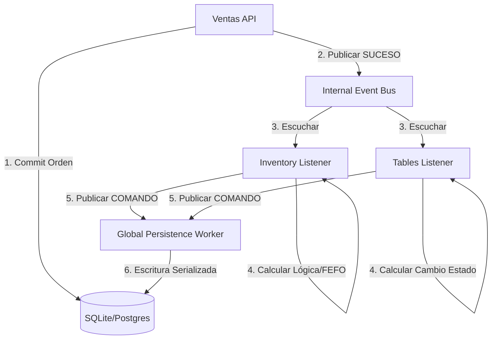

# RFC-003: Refactorización Event-Driven del Módulo de Ventas

**Estado**: En Revisión (Estudio)  
**Autor**: Blackshot Core Team  
**Fecha**: 2026-05-08

## 1. Resumen Ejecutivo
Esta especificación define la transición del módulo de Ventas hacia un modelo de **Emisión Pura**. Se eliminarán todas las orquestaciones directas de efectos secundarios (Inventario, Mesas, Contabilidad) para mejorar la mantenibilidad, eliminar importaciones circulares y reducir la latencia del API.

---

## 2. Arquitectura de Flujo: "Cerebro vs Músculo"

Para garantizar la integridad en SQLite (bloqueo a nivel de archivo) y mantener la independencia de la base de datos, el sistema operará bajo el siguiente esquema:

---

## 3. El Global Persistence Worker (GPW)

El GPW es el único componente con autoridad para realizar escrituras masivas o complejas tras un evento. 

### 3.1. Responsabilidades del GPW
- **Serialización**: Procesa una cola (`asyncio.Queue`) de comandos de escritura para evitar el error `Database is locked` en SQLite.
- **Agnosticismo**: Utiliza el motor de `database.py` para que el sistema siga siendo compatible con cualquier motor SQL (Postgres, MySQL, etc.).
- **Reintento Automático**: Si una escritura falla por un bloqueo temporal, el GPW reintenta la operación sin afectar la experiencia del usuario en el POS.

---

## 4. Especificación de Eventos y Comandos

### 4.1. Sucesos (Events - "Algo pasó")
Emitidos por el módulo de Ventas. Son inmutables y descriptivos.
- `sales.order_created`: Una nueva intención de venta ha sido persistida.
- `sales.payment_received`: Se ha registrado una transacción financiera. Incluye el flag `vacate_table`.

### 4.2. Comandos (Commands - "Haz esto")
Emitidos por los Procesadores (Inventario/Mesas) hacia el GPW.
- `inventory.deplete_stock`: Instrucción detallada de qué ingredientes y lotes restar.
- `tables.update_status`: Instrucción de cambio de estado y timestamps de mesa.

---

## 5. El "Gutting Map": Transformación de Servicios Core

### 5.1. `payment_service.py` (Ventas)
- **ANTES**: Importaba `stock_service`, `bs_sync` y hacía múltiples commits de diferentes dominios.
- **DESPUÉS**: Registra el pago y publica `sales.payment_received`. El resto es responsabilidad de los listeners.

### 5.2. `stock_service.py` (Inventario)
- **ANTES**: Era una función de ayuda llamada directamente por Ventas.
- **DESPUÉS**: Se convierte en un Procesador de Eventos. Calcula el descuento FEFO y envía un comando `inventory.deplete_stock` al GPW. No abre transacciones de escritura propias.

---

## 6. Manejo de Integridad y Concurrencia

### 6.1. Idempotencia de Comandos
Dado que el flujo es asíncrono, cada comando enviado al GPW debe llevar un `request_id` (basado en `order_id` + `status`). El GPW verificará si ese comando ya fue ejecutado para evitar duplicidad en el stock.

### 6.2. Write-Ahead Logging (WAL)
Se habilitará WAL en `database.py` para que las consultas de lectura (ej. Dashboard) no se bloqueen mientras el GPW realiza las escrituras serializadas.

---

## 7. Plan de Implementación (Fases)
1. **Infraestructura**: Crear el `GlobalPersistenceWorker` en `pos_core/events/worker.py`.
2. **Listeners**: Implementar procesadores en `inventory/listeners.py` y `tables/listeners.py`.
3. **Migración**: Limpiar progresivamente los servicios de Ventas eliminando importaciones cruzadas.

---

## 8. Conclusión
Este modelo separa el **Cerebro** (Lógica de Negocio) del **Músculo** (Escritura en DB). Esto asegura que BlackShot POS sea rápido, no sufra bloqueos de base de datos y sea extremadamente fácil de mantener a largo plazo.
