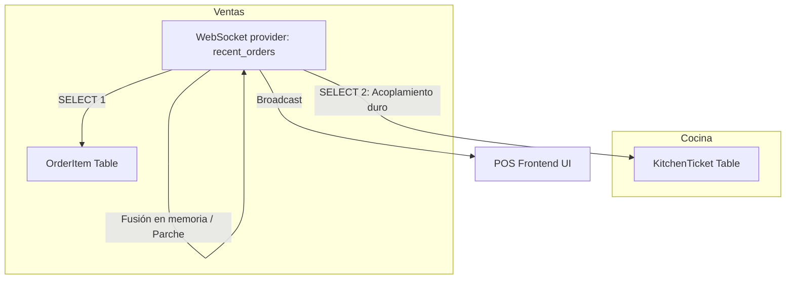
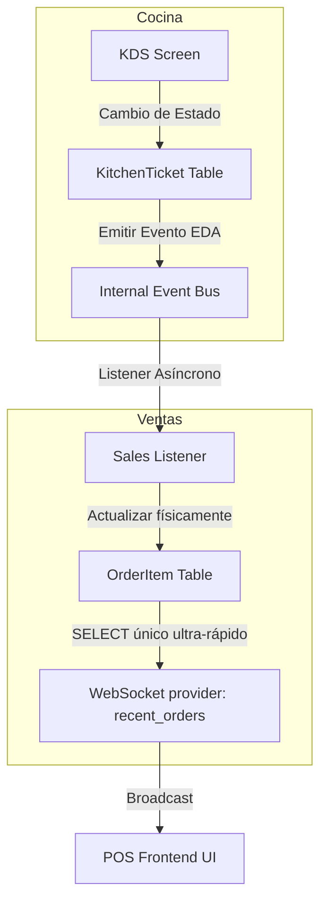

# Plan de Desacoplamiento Limpio: Proveedor de WebSockets de Ventas

Este documento describe la propuesta técnica para limpiar y desacoplar por completo el módulo de **Ventas** del módulo de **Cocina** en el WebSocket de tiempo real (`recent_orders`), eliminando la fusión de datos en memoria y adoptando una arquitectura pura guiada por eventos (**EDA**) con una única fuente de verdad.

---

## 🎯 Objetivo

Eliminar la consulta redundante e in-memory override a la tabla `kitchenticket` dentro del proveedor `recent_orders` del WebSocket de Ventas. A partir de ahora, Ventas se servirá exclusivamente de su propio modelo físico (`OrderItem.status`), el cual ya es actualizado de manera robusta y en tiempo real a través de los listeners de **EDA** implementados.

---

## 🏗️ Comparativa de Arquitectura

### 🔴 Estado Actual (Acoplamiento en Lectura)


### 🟢 Estado Propuesto (Desacoplamiento Puro)


---

## 🛠️ Plan de Trabajo

### Paso 1: Simplificar `provide_recent_orders` en `pos_core/kitchen/providers.py`

#### [MODIFY] [providers.py](file:///home/kaberromero/Documentos/proyectos/BlackShotPOS/pos_core/kitchen/providers.py)

Eliminar la carga de `KitchenTicket`, el diccionario `kitchen_status_map` y la fusión manual en memoria de los ítems. En su lugar, serializar directamente los objetos de `Order` leídos de la base de datos de ventas (los cuales ya tienen sus `OrderItem.status` correctos y sincronizados físicamente).

**Código anterior (Ejemplo de complejidad a eliminar):**
```python
    # Obtener estados de cocina para estas órdenes
    stmt = select(KitchenTicket).where(KitchenTicket.order_id.in_(order_ids))
    result = await db.execute(stmt)
    tickets = result.scalars().all()
    
    # Mapeo de item_id -> status de cocina
    kitchen_status_map: Dict[int, str] = {t.item_id: t.status for t in tickets}
    # ... bucle for complejo para fusionar e inyectar status_str
```

**Código propuesto (Limpio, directo y eficiente):**
```python
@topic_provider("recent_orders")
async def provide_recent_orders(db: AsyncSession):
    """
    Proveedor para el tópico 'recent_orders'.
    Optimizada y Desacoplada: Lee el estado físico real de Ventas,
    aprovechando la sincronización en tiempo real provista por EDA.
    """
    from pos_core.sales.services.order_lifecycle_service import get_orders
    from pos_core.sales.schemas import OrderRead
    
    orders = await get_orders(db)
    data = []
    
    for o in orders:
        order_dict = OrderRead.model_validate(o).model_dump(mode="json")
        item_statuses = []
        
        # Leemos el estado del producto directamente de la base de datos de ventas
        for item in order_dict.get("items", []):
            s = item.get("status")
            status_str = s.value if hasattr(s, "value") else str(s)
            item_statuses.append(status_str)
        
        # Síntesis rápida de estado de la orden para la UI (Meseros)
        if any(s == "PREPARING" for s in item_statuses):
            order_dict["status"] = "PREPARING"
        elif all(s in ["READY", "DELIVERED", "PAID", "CANCELLED"] for s in item_statuses) and item_statuses:
            if any(s == "READY" for s in item_statuses):
                order_dict["status"] = "READY"
            elif all(s in ["DELIVERED", "CANCELLED"] for s in item_statuses):
                order_dict["status"] = "DELIVERED"
        else:
            order_dict["status"] = "PENDING"
        
        data.append(order_dict)
            
    return sorted(data, key=lambda x: x["created_at"], reverse=True)
```

---

## 📈 Beneficios Técnicos Esperados

1. **Rendimiento de Base de Datos**: Reducción del **50%** en la cantidad de queries SQL ejecutados por cada actualización del WebSocket de mesas y órdenes.
2. **Independencia de Módulos**: El módulo de cocina podría ser apagado o migrado a otro microservicio independiente y el WebSocket de ventas seguiría funcionando sin arrojar errores de importación o consulta.
3. **Mantenibilidad**: Código limpio, fácil de leer y libre de lógica en memoria redundante.
