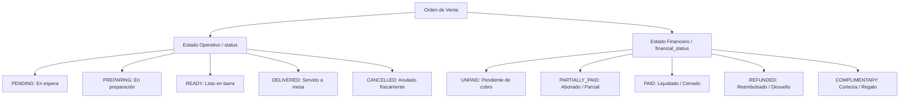

# Diseño de Arquitectura Financiera: Separación de Estados y Gestión de Cortesías

Este documento presenta un análisis profundo sobre cómo maneja BlackShot POS las transacciones financieras actualmente, y detalla un plan estructurado para robustecer el sistema mediante la separación del **Estado Operativo** y el **Estado Financiero**, la formalización de **Pagos Parciales**, y la introducción del concepto de **Cortesías de la Casa**.

---

## 1. Estado Actual: ¿Cómo maneja BlackShot POS los pagos hoy?

### A. Pagos Parciales en el POS Actual
El backend de BlackShot POS cuenta con una excelente base en `pos_core/sales/payment_service.py` que soporta de forma nativa múltiples abonos (`Payment`s) para una sola orden:
1. La orden calcula su saldo restante mediante la propiedad dinámica `balance_due`:
   $$\text{balance\_due} = \max(0.0, \text{total\_amount} - \sum \text{payments})$$
2. Cada abono se registra como un registro individual en la tabla `Payment` asociado a la orden (`order_id`).
3. El total de caja esperado (`expected_cash`, `expected_card`, etc.) se actualiza en tiempo real con cada abono parcial.

### B. La Limitación de Estado
A pesar de que los pagos parciales funcionan a nivel numérico en la base de datos, el sistema sufre las siguientes limitaciones de estado:
* **Estado Mezclado:** Existe un único campo `status` en la orden (`Order.status`) que mezcla la operación con las finanzas. 
* **Ocultamiento de Abonos:** Si una orden de `$500` recibe un pago parcial de `$400` (dejando `$100` pendientes), la orden sigue en estado operativo (ej: `DELIVERED` o `PENDING`). No existe ningún indicador visual ni lógico (`status`) que le diga al cajero: *"Esta orden ya tiene abonos registrados (Abonado)"*.
* **El dilema de la Cancelación:** Si se cancela una orden ya completada/pagada, se marca simplemente como `CANCELLED`. No hay diferencia entre una orden que se canceló antes de prepararse (cero costo) y una que se canceló después de haberse cobrado y servido (devolución financiera real).

---

## 2. Nueva Propuesta: Separación de Estados (Operativo vs. Financiero)

La solución óptima consiste en separar la vida física del producto (Cocina) de la vida monetaria del ticket (Caja) en dos campos independientes:



### Definición de Estados Financieros

1. **`UNPAID` (Pendiente):** La orden no ha recibido ningún abono. Su `balance_due` es igual al `total_amount`.
2. **`PARTIALLY_PAID` (Abonado):** La orden ha recibido uno o más pagos parciales, pero aún queda saldo pendiente ($0 < \text{balance\_due} < \text{total\_amount}$).
3. **`PAID` (Liquidado):** La orden ha sido pagada en su totalidad ($\text{balance\_due} = 0.0$).
4. **`REFUNDED` (Reembolsado/Devuelto):** La orden fue cobrada originalmente (`PAID`), pero posteriormente se canceló, devolviendo el dinero de forma justificada a través de la caja chica.
5. **`COMPLIMENTARY` (Cortesía):** La orden es un regalo autorizado de la casa. Su saldo de cobro esperado es \$0.00, pero se registra contablemente y de forma operativa.

---

## 3. Plan de Mejora: Gestión de Cortesías (Complimentary)

Una cortesía no es un simple descuento del 100%. Debe registrarse con rigor operativo y contable para evitar fraudes y mantener cuadradas las existencias del inventario.

### Flujo de Trabajo de una Cortesía:

```
[POS Frontend] -> Botón "Marcar como Cortesía" -> Seleccionar Autorizador y Motivo (Ej: Cliente VIP)
      |
      v
[FastAPI Backend] -> Valida credenciales del autorizador (Roles: Admin / Manager)
      |
      +---> Cambia financial_status a COMPLIMENTARY y total_amount a 0.0
      |
      +---> Envía evento a Cocina (KDS) -> Se prepara el producto normalmente
      |
      +---> Envía evento a Inventario -> Se descuenta el stock de ingredientes consumidos
      |
      +---> Envía evento a Contabilidad (Shift) -> expected_cash no sube, se registra costo interno
```

### Integración en Contabilidad y Caja Chica
* **expected_cash:** El total esperado de efectivo no se incrementa, ya que el cliente pagó \$0.00.
* **Costo de Cortesía:** El backend calcula automáticamente el costo interno de los ingredientes consumidos (basado en la receta de `RecipeItem` y el costo promedio de inventario) y lo suma a una cuenta de gastos llamada *"Gastos por Cortesías / Mermas"*. Esto permite al dueño saber exactamente cuánto dinero regaló la casa en insumos al final del mes.

---

## 4. Plan Técnico de Implementación

### Fase 1: Cambios en el Modelo de Base de Datos
Actualizar `pos_core/sales/models.py`:

```python
class OrderFinancialStatus(str, Enum):
    UNPAID = "UNPAID"
    PARTIALLY_PAID = "PARTIALLY_PAID"
    PAID = "PAID"
    REFUNDED = "REFUNDED"
    COMPLIMENTARY = "COMPLIMENTARY"

# En el modelo Order:
class Order(SQLModel, table=True):
    # ... campos actuales ...
    status: OrderStatus = Field(default=OrderStatus.PENDING, index=True) # Exclusivo para Cocina/Preparación
    financial_status: OrderFinancialStatus = Field(default=OrderFinancialStatus.UNPAID, index=True) # Exclusivo para Caja
    
    courtesy_reason: Optional[str] = Field(default=None, description="Motivo si la orden es de cortesía")
    courtesy_by_uuid: Optional[str] = Field(default=None, description="UUID del manager que autorizó la cortesía")
```

### Fase 2: Actualización de la Lógica de Pagos (`payment_service.py`)
Modificar la actualización de estado en `add_payment`:

```python
    # ... cálculo de abono real ...
    
    # 3. Actualizar estado financiero de la orden
    if order.balance_due <= 0:
        order.financial_status = OrderFinancialStatus.PAID
    elif order.balance_due > 0 and len(order.payments) > 0:
        order.financial_status = OrderFinancialStatus.PARTIALLY_PAID
```

### Fase 3: Proceso de Reembolso (`order_action_service.py`)
Cuando se cancele una orden completada:

```python
async def refund_order(session: AsyncSession, order_id: int, reason: str, manager_uuid: str):
    order = await order_repo.get_by_id(session, order_id)
    
    if order.financial_status == OrderFinancialStatus.PAID:
        order.financial_status = OrderFinancialStatus.REFUNDED
        # Generar un registro formal de salida de caja en contabilidad
        await add_cash_movement(
            session,
            shift_id=order.shift_id,
            type=CashMovementType.EXPENSE,
            amount=sum(p.amount for p in order.payments),
            reason=f"Reembolso de Orden #{order_id}: {reason}",
            user_id=manager_uuid
        )
```

### Fase 4: Migración de Base de Datos
Crear un script manual en `migrations/` o agregar lógica en `pos_core/database.py` que:
1. Agregue las nuevas columnas `financial_status`, `courtesy_reason`, y `courtesy_by_uuid`.
2. Ejecute un script de alineación de datos inicial:
   * Si `status == "PAID"`, entonces `financial_status = "PAID"` y `status = "DELIVERED"`.
   * Si `status == "CANCELLED"`, entonces `financial_status = "REFUNDED"` (si tenía pagos) o `UNPAID` (si no tenía pagos).
   * Por defecto, establecer `financial_status = "UNPAID"`.

---

## 5. Diseño para la Interfaz de Usuario (Frontend SvelteKit)

En la interfaz del mesero y cajero, las tarjetas de órdenes se verán enriquecidas con dos etiquetas de estado (badges) bien diferenciadas:

* **Tarjeta Tradicional (Mesa 4):**
  * `[ Preparando ]` *(Etiqueta Azul)*
  * `[ Pendiente de Pago ]` *(Etiqueta Gris)*

* **Tarjeta con Pago Parcial (Mesa 2):**
  * `[ Listo en Barra ]` *(Etiqueta Verde)*
  * `[ Abonado ($400/$500) ]` *(Etiqueta Amarilla)*

* **Tarjeta de Cortesía (Mesa VIP):**
  * `[ Entregado ]` *(Etiqueta Gris Claro)*
  * `[ Cortesía (Regalo) ]` *(Etiqueta Púrpura)*

---

Este plan establece una arquitectura de robustez financiera que no solo cuadra la contabilidad a nivel matemático, sino que brinda visibilidad completa y auditoría de clase mundial a los operadores del negocio.
