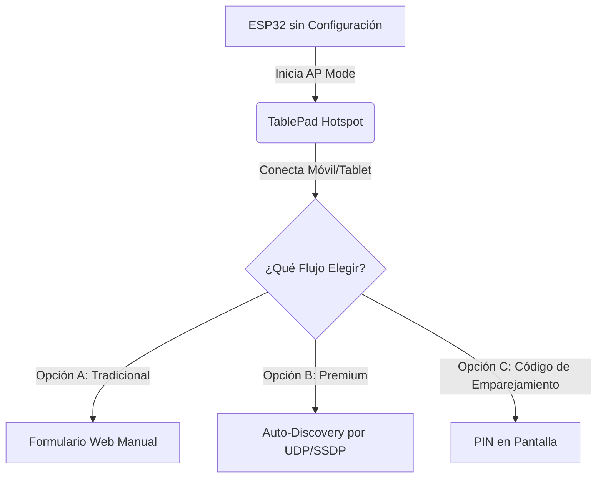

# Plan de Diseño: Portal de Configuración y Setup Wizard para ESP32 (TablePads)

Este documento detalla las opciones arquitectónicas y de diseño de experiencia de usuario para provisionar, conectar y configurar pantallas físicas **ESP32 (TablePads)** en un entorno de producción real, resolviendo la limitación de hardware (sin teclado, IPs dinámicas y aprovisionamiento seguro de tokens).

---

## 1. El Problema en el Mundo Real
En el simulador pasamos `--token` y `--host` como argumentos de terminal. Sin embargo, en un ESP32 real instalado en una mesa de la cafetería:
1. **No hay teclado físico** para ingresar la contraseña de la red Wi-Fi local de la cafetería.
2. **La IP del POS Central/Local puede cambiar** (DHCP dinámico) o ser asignada automáticamente por la red.
3. El dispositivo necesita **provisionar de forma segura su token único** sin que el operador tenga que copiar y pegar strings largos y complejos.
4. El administrador del POS necesita **saber la IP y dirección MAC** de cada dispositivo para diagnosticar problemas de red.

---

## 2. Opciones de Arquitectura para el Setup

A continuación, se proponen **tres opciones** organizadas de menor a mayor nivel de sofisticación y experiencia de usuario.



---

### Opción A: El Portal Cautivo Tradicional (Totalmente Autónomo)
El ESP32 actúa como un servidor autónomo para su configuración inicial.

#### Flujo de Operación
1. **Boot**: Si el ESP32 no se puede conectar a la última red Wi-Fi guardada, arranca en modo **Access Point (SoftAP)** emitiendo una red Wi-Fi propia (ej. `Blackshot-TablePad-SETUP`).
2. **Conexión**: El instalador/mesero se conecta a esa Wi-Fi con su teléfono móvil. Se despliega automáticamente un **Portal Cautivo (Captive Portal)**.
3. **Formulario**: El portal sirve una página HTML sencilla con un formulario:
   * Selector de Redes Wi-Fi escaneadas en tiempo real.
   * Contraseña de Wi-Fi.
   * IP y Puerto del Servidor POS (ej. `192.168.1.100:8400`).
   * Token del Dispositivo (generado previamente en la UI del POS).
4. **Reboot**: El ESP32 guarda los datos en su almacenamiento permanente no volátil (NVS), se reinicia y se conecta como cliente.

*   **Pros:** Sencillo de programar a nivel firmware; no requiere cambios en el protocolo del POS.
*   **Cons:** El instalador tiene que copiar manualmente el Token largo del POS al formulario del teléfono. Si la IP del POS cambia, hay que reconfigurar manualmente.

---

### Opción B: "Zero-Config" Wizard + Auto-Discovery (Premium ✨)
Inspirado en la facilidad de emparejamiento de dispositivos inteligentes modernos. El POS y el ESP32 cooperan para auto-descubrirse.

#### Flujo de Operación
1. **Conexión Wi-Fi Simplificada**:
   * El ESP32 inicia en modo **Hotspot**. El instalador se conecta e ingresa **únicamente la contraseña de la red Wi-Fi de la cafetería**.
   * El ESP32 se conecta a la Wi-Fi de la cafetería y obtiene una IP local (ej. `192.168.1.45`).
2. **Auto-Discovery por UDP Broadcast**:
   * El ESP32 empieza a emitir periódicamente un paquete UDP (ej. por puerto `9000`) indicando su presencia:
     ```json
     {
       "device_id": "aa:bb:cc:dd:ee:ff",
       "ip": "192.168.1.45",
       "type": "esp32",
       "status": "unpaired"
     }
     ```
3. **Detección en el POS**:
   * El backend de FastAPI escucha en el puerto `9000`. Al recibir el paquete, registra temporalmente el dispositivo no emparejado.
   * En el Panel Administrativo del POS, bajo la sección **"IoT Setup Wizard"**, aparece una alerta parpadeante:
     * *“¡Nuevo TablePad detectado en 192.168.1.45 (MAC: AA:BB:CC:DD:EE:FF)! [Asignar a Mesa]”*
4. **Aprovisionamiento Remoto de un Clic**:
   * El administrador hace clic en **[Asignar a Mesa 3]**.
   * El POS genera un token único, asocia la MAC del ESP32 a la `Mesa 3` en la base de datos, y envía una petición HTTP `POST` directa a la IP del ESP32 (`http://192.168.1.45/configure`):
     ```json
     {
       "token": "token-seguro-generado-por-pos",
       "host": "192.168.1.100:8400",
       "table_id": 3
     }
     ```
   * El ESP32 recibe la configuración, la almacena y se conecta inmediatamente al WebSocket de forma transparente.

*   **Pros:** **Experiencia del usuario WOW (Premium).** Cero copiado de tokens. Cero entrada manual de IPs (el POS se autoinyecta). Captura la MAC e IP del dispositivo en tiempo real automáticamente.
*   **Cons:** Requiere levantar un listener UDP básico en el backend de FastAPI y añadir una interfaz en SvelteKit para el emparejamiento.

---

### Opción C: Smart PIN Pairing (Estilo Apple TV)
El dispositivo muestra un código en pantalla para su registro seguro una vez conectado a la red.

#### Flujo de Operación
1. El ESP32 se conecta a la Wi-Fi local mediante el portal de acceso.
2. Al no tener token, el ESP32 contacta al POS por descubrimiento de red local (o IP predefinida) y solicita un PIN de emparejamiento.
3. El ESP32 despliega en su pantalla de 3.5"/4.3" un PIN dinámico (ej. `8 4 2 1`).
4. El administrador entra a la mesa del POS, da clic en "Emparejar Dispositivo" e ingresa el código `8421`.
5. El servidor autoriza el handshake y envía las credenciales definitivas al dispositivo.

*   **Pros:** Extremadamente seguro y da una excelente imagen de cara al cliente o instalador.
*   **Cons:** Requiere que el ESP32 tenga pantalla integrada funcionando antes del emparejamiento (lo cual ya tenemos) y una capa de persistencia temporal del PIN en el POS.

---

## 3. Propuesta de Modificación al Schema de la Base de Datos

Para soportar cualquiera de estas opciones y guardar el estado real de la red física del dispositivo, proponemos extender el modelo `IoTDevice` en `pos_core/iot/models.py`:

```python
class IoTDevice(SQLModel, table=True):
    id: Optional[int] = Field(default=None, primary_key=True)
    device_id: str = Field(unique=True, index=True)      # Dirección MAC física (Ej. "AA:BB:CC:DD:EE:FF")
    token: str = Field(unique=True, index=True)         # Token de autenticación WebSocket
    name: Optional[str] = Field(default=None)            # "Pantalla Mesa 5"
    type: str = Field(default="esp32")                   # "esp32", "esp8266"
    table_id: Optional[int] = Field(default=None, foreign_key="table.id")
    is_active: bool = Field(default=True)
    
    # NUEVOS CAMPOS DE RED Y CONTROL
    mac_address: Optional[str] = Field(default=None)     # Almacenamiento explícito de la MAC
    ip_address: Optional[str] = Field(default=None)      # Última IP reportada por el router (Ej. "192.168.1.45")
    wifi_ssid: Optional[str] = Field(default=None)       # SSID de la red Wi-Fi a la que está conectada
    
    # Health & Metadata
    battery_level: Optional[int] = Field(default=None)
    rssi: Optional[int] = Field(default=None)            # Intensidad de Wi-Fi útil para posicionamiento
    firmware_version: Optional[str] = Field(default=None)
    
    last_seen: Optional[datetime] = Field(default=None)
    created_at: datetime = Field(default_factory=datetime.utcnow)
```

---

## 4. Estructura de Endpoints Recomendada para FastAPI

Para soportar el **Setup Wizard del POS** (Opción B), se añadirían los siguientes endpoints a `pos_core/iot/admin_router.py`:

1.  **`GET /api/v1/pos/iot/wizard/unpaired`**: Retorna los dispositivos detectados en la red local vía UDP que aún no están asignados a ninguna mesa.
2.  **`POST /api/v1/pos/iot/wizard/pair`**: Asocia un dispositivo no emparejado (`device_id`/MAC) a una mesa.
    *   Genera el Token único.
    *   Realiza la llamada HTTP POST al ESP32 a través de su `ip_address` registrada para inyectarle el Token y la URL del POS.
3.  **`GET /api/v1/pos/iot/devices`**: Ahora incluye en su respuesta la `ip_address`, `mac_address` y el `rssi` (nivel de señal) para mostrar en el mapa de mesas del POS si el dispositivo está en línea y con qué calidad de conexión.

---

## 5. Recomendación de Diseño
Para Blackshot, la **Opción B (Zero-Config + Auto-Discovery)** es la que mejor se alinea con la filosofía del proyecto por tres razones:
1. **Facilidad de instalación**: En una cafetería con 10 o 20 mesas, configurar una por una escribiendo IPs dinámicas y tokens manualmente es propenso a errores. El auto-descubrimiento permite al instalador ir mesa por mesa solo metiendo Wi-Fi, y luego dar 10 clics en el POS Central para asociarlas todas de forma visual.
2. **Robustez ante cortes de energía o cambios de router**: Si el router de la cafetería se reinicia y cambia las IPs del servidor y de las mesas, el protocolo de broadcast UDP autodetecta los cambios y se reconfigura solo.
3. **Wow-Factor**: Es una experiencia comercial de nivel corporativo que destaca el valor tecnológico del ecosistema Blackshot.
