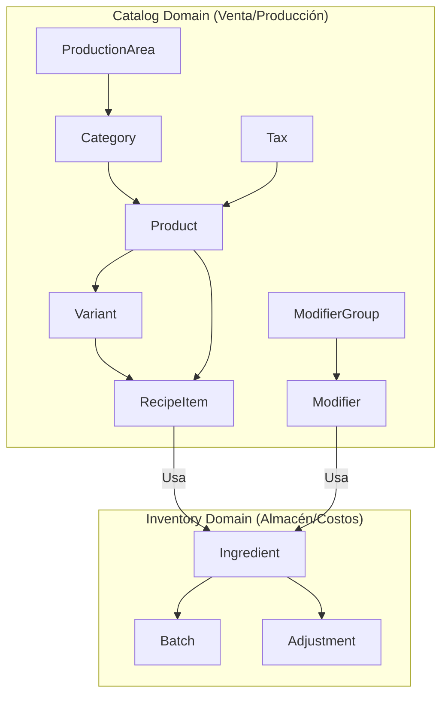

# Plan de Refactorización: Separación de Catálogo e Inventario (DDD Approach)

Este documento detalla la estrategia para divorciar la lógica de **Menú/Venta (Catalog)** de la lógica de **Almacén/Materia Prima (Inventory)**. Esta separación sigue principios de Diseño Orientado al Dominio (DDD) para mejorar la mantenibilidad y escalabilidad del ecosistema Blackshot.

## 1. Arquitectura de Dominios



### Definiciones de Responsabilidad
- **Catalog**: Define qué vendemos, a qué precio, en qué categorías y dónde se imprime el ticket de preparación. Contiene la "Receta" como una definición de uso.
- **Inventory**: Define qué tenemos físicamente, cuánto nos queda, lotes de caducidad y ajustes de merma. Es el "Silo" de materia prima.

---

## 2. Cambios en Modelos (SQLModel)

### pos_core/catalog/models.py [NUEVO]
Se moverán las siguientes clases desde `inventory/models.py`:
- `Category`, `ProductionArea`
- `Product`, `ProductVariant`, `POSPreset`
- `ModifierGroup`, `Modifier`, `ModifierQuantity`
- `Measure`, `Tax`
- `RecipeItem` (Actúa como puente, importando `Ingredient` vía string reference).

### pos_core/inventory/models.py [LIMPIO]
Solo se mantendrán:
- `Ingredient`
- `IngredientBatch`
- `InventoryAdjustment`, `AdjustmentReason`

> [!IMPORTANT]
> **Manejo de Relaciones y Dependencias Circulares:**
> 1. Para evitar importaciones circulares, las relaciones en `Catalog` que apuntan a `Inventory` (ej. `RecipeItem -> Ingredient`) usarán referencias de string y `TYPE_CHECKING`.
> 2. Se eliminarán las relaciones `back_populates` desde `Ingredient` hacia `RecipeItem` o `Modifier`. El dominio de Inventario no debe conocer el Catálogo. Si se requiere saber dónde se usa un ingrediente, se realizará vía consultas (Queries) en el servicio, no mediante propiedades del modelo.

---

## 3. Estructura de Archivos Propuesta

```text
pos_core/
├── catalog/
│   ├── __init__.py
│   ├── models.py          # Modelos de Menú y Producción
│   ├── router.py          # Endpoints: /api/v1/pos/catalog/*
│   └── services/
│       ├── category_service.py
│       ├── product_service.py
│       ├── modifier_service.py
│       └── recipe_service.py
├── inventory/
│   ├── __init__.py
│   ├── models.py          # Modelos de Stock e Ingredientes
│   ├── router.py          # Endpoints: /api/v1/pos/inventory/*
│   ├── unit_converter.py  # Utilidades de conversión de unidades
│   └── services/
│       ├── ingredient_service.py
│       ├── stock_service.py
│       └── adjustment_service.py
```

---

## 4. Plan de Ejecución Detallado

### Fase 1: Creación del Módulo Catalog
1. Crear `pos_core/catalog/` y sus subdirectorios.
2. Copiar `unit_converter.py` a una ubicación accesible por ambos (podría quedarse en `inventory` o moverse a `pos_core/utils`). Se recomienda `pos_core/inventory/unit_converter.py` ya que el catálogo lo usa para traducir recetas a unidades de almacén.

### Fase 2: Migración de Código
1. **Modelos**: Mover las clases mencionadas a `catalog/models.py`.
2. **Servicios**: Mover los archivos de lógica de negocio. Actualizar imports internos.
3. **Routers**: 
    - Crear `catalog/router.py` agrupando los endpoints de productos, categorías, modificadores y áreas de producción.
    - El nuevo `inventory/router.py` solo tendrá endpoints de `/ingredients` y `/adjustments`.

### Fase 3: Integración en Main
Actualizar `main.py` para registrar los nuevos prefijos:
```python
# main.py
from pos_core.catalog.router import router as catalog_router
from pos_core.inventory.router import router as inventory_router

app.include_router(catalog_router, prefix="/api/v1/pos/catalog", tags=["Catálogo"])
app.include_router(inventory_router, prefix="/api/v1/pos/inventory", tags=["Inventario"])
```

### Fase 4: Impacto en Otros Módulos
- **Sales**: El módulo de ventas deberá importar `Product` desde `pos_core.catalog.models`.
- **Printing**: Las áreas de producción y lógica de impresión ahora dependen del módulo `catalog`.
- **Analytics**: Los reportes de ventas por producto ahora apuntan al nuevo catálogo.

---

## 5. Impacto en el Frontend (bs_frontend)

Este cambio es **Breaking** para la API. Se requiere actualizar las llamadas en Svelte:
- `GET /api/v1/pos/products` -> `GET /api/v1/pos/catalog/products`
- `GET /api/v1/pos/ingredients` -> `GET /api/v1/pos/inventory/ingredients`
- `GET /api/v1/pos/production` -> `GET /api/v1/pos/catalog/production-areas`

> [!TIP]
> Se recomienda implementar un "Legacy Router" temporal si se desea una migración gradual, pero para un desarrollo activo, el "Clean Break" es preferible para forzar el orden.

## 6. Verificación de Éxito
- [ ] La base de datos mantiene las relaciones (FKs) intactas tras el movimiento de clases en SQLModel.
- [ ] No hay errores de importación circular al iniciar el servidor.
- [ ] Los tests de inventario (descuento de stock al vender) siguen funcionando al cruzar los dominios.
- [ ] El frontend puede listar el menú usando el nuevo endpoint de catálogo.

