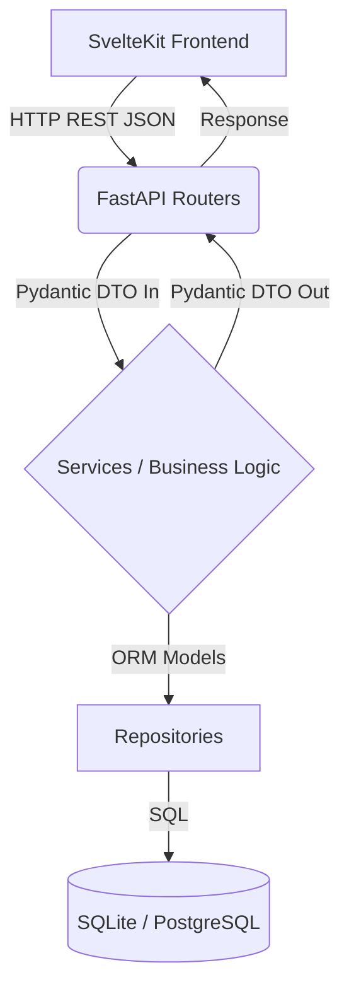

# Master Plan de Refactorización Arquitectónica: Blackshot POS

## 1. Resumen Ejecutivo y Objetivos del Proyecto

El presente documento define la hoja de ruta técnica para transformar Blackshot POS de un Producto Mínimo Viable (MVP) iterativo a una plataforma SaaS resiliente, escalable y mantenible. Actualmente, el sistema sufre de fragilidad estructural debido al rápido desarrollo, lo que resulta en alto acoplamiento, "God Objects" y mapeo manual de datos.

El éxito de este proyecto no se medirá en nuevas funcionalidades, sino en la **reducción del tiempo de resolución de bugs, la facilidad para integrar nuevos desarrolladores y la eliminación de errores silenciosos en producción.**

### 1.1 Principios Arquitectónicos Adoptados
Para esta refactorización, el equipo de ingeniería se alineará bajo los siguientes paradigmas:
*   **Separation of Concerns (SoC) / Clean Architecture:** El protocolo de red (HTTP/FastAPI) no debe conocer las reglas de negocio. Las reglas de negocio no deben conocer la base de datos (SQLAlchemy).
*   **Fail-Fast & Tipado Fuerte:** Si un dato está mal formado, el sistema debe fallar en la capa límite (los validadores de Pydantic), no lanzar un `KeyError` 10 líneas más abajo en el servicio.
*   **Single Source of Truth (SSOT):** Las reglas sobre cómo se calcula un total o un impuesto vivirán en un solo lugar.

---

## 2. Evaluación de Deuda Técnica y Radio de Impacto (Blast Radius)

Antes de alterar el código, es crucial entender qué partes del sistema están en riesgo de romperse.

### 2.1 El Problema del Mapeo Manual (El "Spaguetti JSON")
*   **Contexto:** Funciones como `format_order_json` en `pos_core/sales/service.py` actúan como traductores manuales entre la DB y la API.
*   **Riesgo Actual:** Un cambio en la base de datos no es detectado por el analizador estático (Mypy) ni por el IDE hasta que la aplicación crashea en tiempo de ejecución tratando de acceder a una clave de diccionario inexistente.
*   **Solución:** Delegar la serialización a los DTOs de Pydantic usando `ConfigDict(from_attributes=True)`.
*   **Blast Radius (Radio de Impacto):** Crítico. Afecta directamente los payloads que consume SvelteKit. Se requiere coordinación estricta con el frontend.

### 2.2 God Objects y Lógica Acoplada
*   **Contexto:** `pos_core/sales/service.py` tiene más de 500 líneas y gestiona la vida entera de la aplicación (crear órdenes, pagar, manejar mesas, calcular analíticas).
*   **Riesgo Actual:** Dos desarrolladores no pueden trabajar en este archivo simultáneamente sin causar conflictos de Git (Merge Conflicts). La lógica de analíticas puede accidentalmente alterar el estado de una orden.
*   **Solución:** Desacoplamiento vertical por dominios (ej. `orders`, `payments`, `analytics`).
*   **Blast Radius:** Moderado. Los endpoints de FastAPI seguirán siendo los mismos, pero sus dependencias internas cambiarán drásticamente.

### 2.3 Manejo de Sesiones de Base de Datos
*   **Contexto:** Las sesiones a veces se pasan como parámetros, a veces se instancian manualmente.
*   **Riesgo Actual:** Fugas de memoria (Memory Leaks) por sesiones no cerradas o transacciones que quedan colgadas, bloqueando la base de datos (Deadlocks).
*   **Solución:** Uso estricto de Inyección de Dependencias en FastAPI (`Depends(get_session)`).
*   **Blast Radius:** Bajo. Refactorización estructural interna.

---

## 3. Topología de la Nueva Arquitectura

El sistema transicionará hacia el siguiente modelo mental:

*   **Routers (`router.py`):** Su único trabajo es recibir la petición HTTP, verificar permisos, delegar al Servicio y devolver el DTO de salida con el HTTP Status Code correcto.
*   **Services (`*_service.py`):** El "Cerebro". Valida reglas de negocio (Ej: "La mesa 5 no se puede liberar porque no está pagada").
*   **Repositories (`*_repository.py`):** El "Músculo". Contiene las sentencias de SQLAlchemy. Si mañana cambiamos de Base de Datos, solo cambia esta capa.

---

## 4. Hoja de Ruta de Refactorización Estratégica

Para evitar el temido "Big Bang Rewrite" (donde nada funciona por semanas), la migración se hará en fases aisladas. Cada fase debe integrarse a la rama principal (main) y ser completamente funcional antes de iniciar la siguiente.

### Fase 1: Cimientos (DTOs y Manejo de Errores)
**Por qué:** No podemos desacoplar servicios si no tenemos una forma estándar de comunicarnos entre ellos y con el frontend.
> [!IMPORTANT]
> **Guía de Implementación Exacta:** Ver [REFACTOR_FASE_1_DETALLE.md](file:///home/kaber420/Documentos/proyectos/blackshot/drafts/REFACTOR_FASE_1_DETALLE.md) para el código y explicaciones técnicas de esta fase.
1.  Creación de excepciones de negocio (`BusinessLogicError`) y su Exception Handler global en FastAPI.
2.  Implementación de los DTOs (Data Transfer Objects) usando Pydantic en `pos_core/sales/schemas.py`.
3.  *Estrategia de Rollback:* Alta reversibilidad. Si los DTOs fallan en staging, se revierte el commit del Router.

### Fase 2: Aislamiento de Capa de Datos (El Patrón Repositorio)
**Por qué:** Para poder limpiar `service.py`, primero debemos sacar todas las sentencias `select()`, `where()`, y `session.exec()` a un lugar seguro.
1.  Creación de `pos_core/sales/repository.py`.
2.  Desarrollo de métodos como `get_active_orders()`, `get_order_with_relations()`.
3.  Reemplazo progresivo en `service.py`: En lugar de consultar la base de datos, llama al Repositorio.
4.  *Estrategia de Migración:* Endpoint por endpoint. No se refactoriza todo el archivo de golpe.

### Fase 3: Desintegración del Monolito (Refactor del Servicio)
**Por qué:** Con la base de datos aislada, podemos dividir las reglas de negocio en módulos con Responsabilidad Única y corregir flujos de negocio acoplados.
1.  Dividir `pos_core/sales/service.py` en:
    *   `order_service.py` (Flujo de vida de la orden).
    *   `payment_service.py` (Lógica puramente financiera, registro de pagos).
    *   `analytics_service.py` (Cálculos de dashboards).
2.  Mover la lógica de mesas (ej. `vacate_table_service`) a `pos_core/tables/service.py`.
3.  **Desacoplamiento Estricto de Pagos y Mesas:** Eliminar la llamada a `vacate_table` dentro de `add_payment`. El servicio de pagos no debe asumir que el cliente se retira al pagar (para soportar modelos de cobro por adelantado). La coordinación de "Pagar y Liberar Mesa" si la requiere la UI debe suceder en la capa superior (FastAPI Router o un Servicio Orquestador), manteniendo los dominios 100% aislados.

### Fase 4: Sincronización WebSockets y Frontend
**Por qué:** El frontend necesita depender de contratos estrictos, y los sockets deben enviar la misma estructura exacta que la API REST.
1.  Modificar los eventos de WebSocket (`trigger_broadcast`) para que serialicen el modelo ORM pasándolo directamente a través del Pydantic Schema de la Fase 1.
2.  Generar (o actualizar) los tipos de TypeScript en SvelteKit para que hagan "mirror" exacto de los Schemas de Python.

### Fase 5: Auditoría y Roles Desacoplados
**Por qué:** La seguridad no debe depender de que un desarrollador "recuerde" poner el chequeo en su código.
1.  Centralizar la función `AuditLog` para que reaccione a eventos del Repositorio (Observer Pattern) o se ejecute como un proceso background, sin ensuciar el servicio de órdenes.
2.  Migrar la validación de roles a Dependencias de FastAPI puras (`Depends(require_permission('void_order'))`), blindando los endpoints desde la frontera de la aplicación.

---

## 5. Criterios de Éxito (Definition of Done)

La refactorización se considerará finalizada cuando:
1.  El archivo `pos_core/sales/service.py` deje de existir, reemplazado por módulos específicos.
2.  Cero llamadas a `session.exec()` fuera de un archivo `repository.py`.
3.  Cero funciones que devuelvan manualmente diccionarios `dict` construidos campo por campo.
4.  El frontend no muestre errores de consola relacionados con campos faltantes (`undefined`) en los payloads de órdenes.

---

## 6. Análisis de Viabilidad y Recomendaciones (IA)

He revisado la base de código actual (`pos_core/sales/service.py`, `models.py`) y el plan es **altamente viable y muy necesario**. El `service.py` actual (con más de 500 líneas y un `format_order_json` extremadamente extenso y manual) confirma el diagnóstico de deuda técnica.

Sin embargo, para garantizar una transición sin problemas, propongo que el equipo considere las siguientes observaciones y recomendaciones. Estas no reemplazan su plan, sino que buscan fortalecerlo:

### 6.1 Completitud de los Schemas Pydantic (Atención en Fase 1)
*   **Contexto:** En el borrador detallado (`REFACTOR_FASE_1_DETALLE.md`), el schema `OrderItemRead` define relaciones para `product` y `modifiers`, pero **omite `variant`**.
*   **Riesgo:** La función actual `get_orders_json` carga profundamente las relaciones usando `selectinload(Order.items, OrderItem.variant, ProductVariant.measure)`. Si el modelo Pydantic no incluye el campo de la variante, Pydantic lo descartará silenciosamente en la respuesta final (debido al comportamiento por defecto de excluir lo no definido), rompiendo el frontend de SvelteKit que espera la información de precios, variantes y medidas.
*   **Recomendación:** Expandir los DTOs en la Fase 1 para incluir explícitamente `ProductVariantRead` (que a su vez contenga `MeasureRead`). Revisen línea por línea el `format_order_json` actual para asegurarse de que el schema de Pydantic es un espejo 1:1.

### 6.2 Límites Transaccionales en el Patrón Repositorio (Atención en Fase 2)
*   **Contexto:** Al extraer la lógica a un archivo `repository.py`, suele surgir la duda de dónde colocar los `session.commit()`.
*   **Riesgo:** Si los Repositorios hacen `commit()` internamente, se pierde la capacidad de agrupar múltiples operaciones en una sola transacción (Atomicidad). Por ejemplo, `update_order_status` cambia el estado de la orden Y llama a `process_inventory_depletion`. Si el inventario falla, el estado de la orden debe revertirse (`rollback`).
*   **Recomendación:** El Repositorio debe encargarse puramente del "acceso a datos" (hacer `select`, `session.add()`). El **Servicio** debe mantener el control del límite transaccional, orquestando las llamadas a los repositorios y haciendo el `await session.commit()` final al terminar la lógica de negocio.

### 6.3 Prevención de Dependencias Circulares y Lógica de Mesas (Atención en Fase 3)
*   **Contexto:** Se planea dividir el "God Object" en `order_service`, `payment_service`, `table_service`, etc.
*   **Riesgo:** Funciones como `add_payment` actualmente pagan la orden, actualizan su estado y, opcionalmente, llaman a `vacate_table_service`. Si `payment_service.py` importa `table_service.py`, terminarán con importaciones circulares en Python. Además, **mezclar el concepto de "pago" con "liberar mesa" es un error de negocio**, ya que los clientes pueden pagar por adelantado y sentarse a esperar su comida.
*   **Recomendación:** Desacoplar ambas acciones por completo. El `payment_service` SOLO debe encargarse de registrar la transacción financiera y marcar la orden como pagada. La acción de liberar la mesa debe recaer exclusivamente en el `table_service`. Si desde la UI necesitan un flujo que haga ambas cosas a la vez (ej. pagar e irse), el **Router** o un **Servicio Orquestador** debe encargarse de llamar a `payment_service.add_payment(...)` y luego a `table_service.vacate_table(...)`, manteniendo los dominios completamente independientes.

### 6.4 Estados Visuales de Mesas vs Estado Transaccional (Atención UI/Frontend)
*   **Contexto:** Actualmente, hay confusión en el frontend (`tables/+page.svelte`) donde una mesa simplemente se marca en "rojo" (OCUPADA) perdiendo la rica fidelidad visual de cómo van los platillos, y reconstruyendo la lógica cada vez.
*   **Riesgo:** Si la refactorización backend cambia cómo se emiten los sockets sin estandarizar el UI, el equipo de SvelteKit seguirá parchando los estados visuales (ej. perdiendo los colores de progreso PENDIENTE/COCINANDO/COMPLETO).
*   **Recomendación:** Fijar un estándar claro para el modelo de datos: **La base de datos de Mesas solo debe tener 4 estados físicos:** `Libre`, `Ocupada`, `Reservada`, y `Limpieza`. El color y badge visual de una mesa Ocupada en SvelteKit **NO debe depender del estado físico de la mesa**, sino que debe derivarse automáticamente del `OrderStatus` de su orden activa vinculada (Ej. PENDIENTE = Amarillo, PREPARANDO = Azul, LISTO = Verde). Si una mesa está "Ocupada" pero no tiene orden, entonces sí usar un color gris/rojo de espera.
