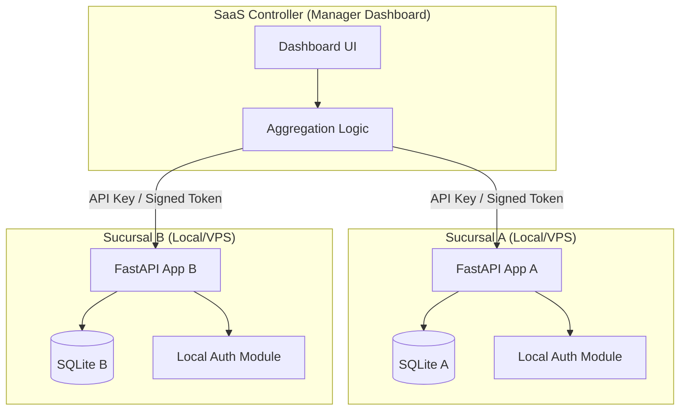

# Estrategia de Autenticación: Blackshot Local-First & Distributed

Este documento define la arquitectura de seguridad para Blackshot POS, priorizando la resiliencia operativa (funcionamiento offline) y la facilidad de despliegue para pequeños emprendedores, sin sacrificar la capacidad de gestión centralizada (SaaS).

## 1. Filosofía de Diseño

*   **Local-First:** El POS debe ser totalmente funcional sin conexión a internet. La autenticación de los empleados ocurre contra la base de datos local (SQLite).
*   **Cero Infraestructura Extra:** No se requieren servicios externos (Logto, SuperTokens Core, Postgres) ni Docker para el funcionamiento básico.
*   **Seguridad Industrial Embebida:** Uso de estándares de la industria (Argon2, JWT, Cookies HTTP-only) implementados mediante librerías probadas en Python y JS.

## 2. Componentes de Seguridad

### A. Autenticación Local (Sucursal)
Cada instancia de Blackshot gestiona su propio pool de usuarios y sesiones.
*   **Motor:** `FastAPI Users` o implementación basada en `Authlib` + `Passlib` (Argon2).
*   **Persistencia:** Base de datos SQLite local.
*   **Manejo de Sesión:** Cookies `HTTP-only` y `Secure` para prevenir ataques XSS.
*   **Roles:** Admin, Manager, Waiter, Kitchen (Basado en el sistema de roles granulares ya existente en `pos_core/roles.py`).

### B. El "Bridge" (Acceso del Manager Central)
Para permitir que un controlador central (Dashboard de Dueño) unifique datos de múltiples sucursales de forma segura:
*   **Mecanismo:** API Keys de grado industrial (similares a Stripe) o JWTs firmados con llaves asimétricas (RS256).
*   **Flujo:** El Manager registra la sucursal -> La sucursal genera un par de llaves -> El Manager guarda la llave privada -> Las peticiones del Manager van firmadas y la sucursal las valida localmente.

## 3. Arquitectura Distribuida

## 4. Ventajas de este Modelo

1.  **Resiliencia Total:** Si cae el internet, la sucursal sigue vendiendo. El login no depende de la nube.
2.  **Privacidad de Datos:** Los datos de cada cliente están físicamente aislados.
3.  **Facilidad de Despliegue:** Ideal para el "pequeño emprendedor". Solo necesita Python y el código fuente.
4.  **Cumplimiento AGPLv3:** Mantiene la integridad del software como una unidad independiente, facilitando el seguimiento de licencias.

## 6. Fidelización y Sincronización de Datos (El Manager Central)

Para que el sistema funcione como una red cohesiva, el Manager Central no solo unifica ventas, sino que actúa como el nodo de sincronización para datos compartidos.

### A. Maestro de Clientes y Fidelidad
*   **Consulta en Tiempo Real:** Cuando una sucursal escanea un QR de fidelidad, pregunta al Manager: `GET /loyalty/verify/{customer_id}`.
*   **Caché Local:** Las sucursales guardan una copia local de los clientes frecuentes para permitir redenciones rápidas y funcionamiento offline.
*   **Sincronización de Puntos:** Al cerrar una venta, la sucursal envía un evento al Manager: `POST /loyalty/add-points`. Si no hay internet, el evento se encola y se envía al recuperar la conexión.

### B. Gestión Global de Promociones
*   **Push de Configuración:** El Manager tiene una interfaz para crear promociones globales. Estas se distribuyen a las sucursales mediante el "Bridge" (API Keys).
*   **Validación Local:** La sucursal aplica la promo localmente basándose en las reglas descargadas del Manager, asegurando que el POS sea rápido durante la venta.

### C. Consolidación de Inventarios
*   **Vista Global:** El Manager puede consultar el stock de "Café en Grano" en todas las sucursales para facilitar transferencias de insumos entre locales (Logística).

---

## 7. Conclusión
Este modelo permite que Blackshot sea **extremadamente ligero** para el emprendedor con una sola sucursal (Zero-Docker, Zero-Cloud), pero **infinitamente escalable** para una cadena de restaurantes mediante el uso del Controlador Central.
