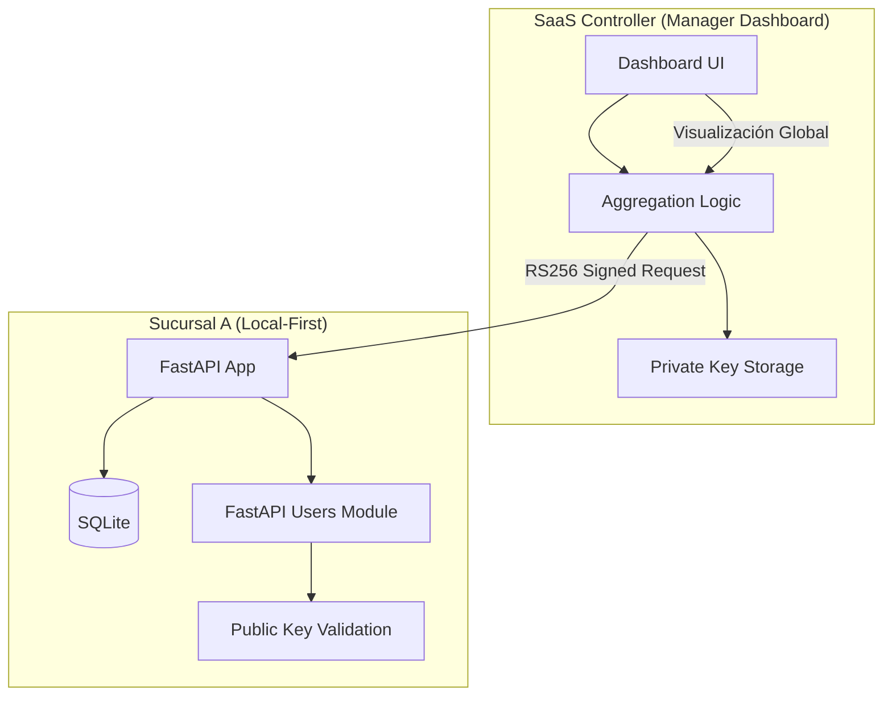

# Estrategia de Autenticación: Blackshot Local-First & Distributed

Este documento define la arquitectura de seguridad para Blackshot POS, priorizando la resiliencia operativa (funcionamiento offline) y la facilidad de despliegue para pequeños emprendedores, sin sacrificar la capacidad de gestión centralizada (SaaS).

## 1. Filosofía de Diseño

*   **Local-First:** El POS debe ser totalmente funcional sin conexión a internet. La autenticación de los empleados ocurre contra la base de datos local (SQLite).
*   **Cero Infraestructura Extra:** No se requieren servicios externos (Logto, Kinde) ni bases de datos complejas (Postgres) para el funcionamiento básico.
*   **Seguridad Industrial Embebida:** Uso de estándares de la industria (Argon2id, JWT, Cookies HTTP-only) implementados mediante librerías probadas.

---

## 2. Pila Tecnológica de Seguridad

Para garantizar que el sistema sea "serio" y resistente a ataques, se utilizarán los siguientes componentes:

| Componente | Tecnología | Razón |
| :--- | :--- | :--- |
| **Framework de Auth** | `FastAPI Users` | Librería madura, auditada y modular. |
| **Hashing de Passwords** | `Argon2id` | Ganador del PHC, resistente a ataques de GPU/ASIC. |
| **Token de Sesión** | `JWT` (JSON Web Tokens) | Estándar, permite validación sin consulta a DB si es necesario. |
| **Transporte** | `HTTP-Only Cookies` | Inmune a robos de token mediante XSS (Scripts maliciosos). |
| **Comunicación Bridge** | `RS256` (Asimétrico) | Permite que el Manager Central firme comandos que la sucursal valida localmente. |

---

## 3. Arquitectura de Componentes

### A. Autenticación Local (Sucursal)
Cada instancia de Blackshot es soberana sobre sus usuarios.
*   **Base de Datos:** SQLite (vía SQLModel/SQLAlchemy).
*   **Esquema:** Extensión del modelo `User` para incluir `organization_id` y `metadata` de permisos granulares.
*   **Flujo:**
    1. El usuario envía credenciales a `/auth/jwt/login`.
    2. El backend valida con Argon2.
    3. El backend responde con una cookie `set-cookie: fastapiusersauth=...; HttpOnly; Secure; SameSite=Strict`.

### B. El "Bridge" (Acceso del Manager Central)
Para unificar múltiples sucursales sin exponerlas a internet abierto de forma insegura.
*   **API Keys:** Cada sucursal genera un par de llaves. El Manager Central usa la llave privada para firmar peticiones.
*   **Seguridad:** La sucursal solo acepta peticiones del Manager si el token está firmado correctamente con su llave pública correspondiente.

---

## 4. Plan de Ejecución (Fases)

### Fase 1: Limpieza y Preparación [MÁS URGENTE]
1.  **Deprecar `omni_auth`:** Marcar el módulo actual para eliminación.
2.  **Instalar Dependencias:**
    ```bash
    pip install "fastapi-users[sqlalchemy]" "passlib[argon2]" pyjwt
    ```

### Fase 2: Configuración del Motor de Identidad
1.  **Modelos de Usuario:** Crear `User` y `UserCreate` usando `SQLModel`.
2.  **UserManager:** Implementar la lógica de `get_user_manager` configurando Argon2.
3.  **Auth Backend:** Configurar el transporte de Cookies y la estrategia JWT.

### Fase 3: Integración con Frontend (SvelteKit)
1.  Ajustar las llamadas a la API para que manejen el envío automático de cookies (`credentials: 'include'`).
2.  Implementar la lógica de "Estado de Sesión" global en Svelte 5 usando `$state`.

### Fase 4: El Bridge de Gestión Central
1.  Implementar middleware en FastAPI que valide una cabecera `X-Blackshot-Bridge-Auth`.
2.  Permitir la sincronización de reportes Z hacia el Manager Central de forma asíncrona.

---

## 5. Arquitectura Visual



---

## 6. Seguridad y Resiliencia

1.  **Funcionamiento Offline:** El 100% de la lógica de login de empleados reside en `FU (FastAPI Users Module)`, por lo que no requiere internet.
2.  **Protección Brute-Force:** Implementación de un middleware de Rate Limiting local.
3.  **Aislamiento:** Un hackeo a la Sucursal A no compromete las credenciales ni los datos de la Sucursal B.

---

## 7. Conclusión
Este plan transforma a Blackshot de un prototipo a un sistema con **seguridad de grado empresarial**. Al usar `FastAPI Users` con `Argon2` y `Cookies`, eliminamos las vulnerabilidades críticas del sistema anterior y sentamos las bases para una red distribuida escalable.
