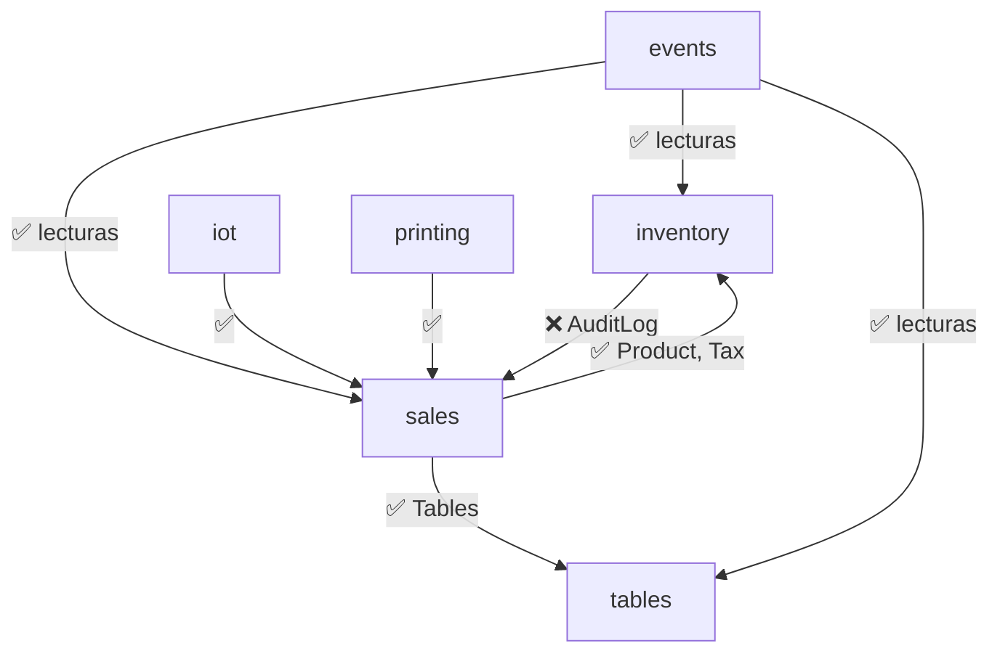
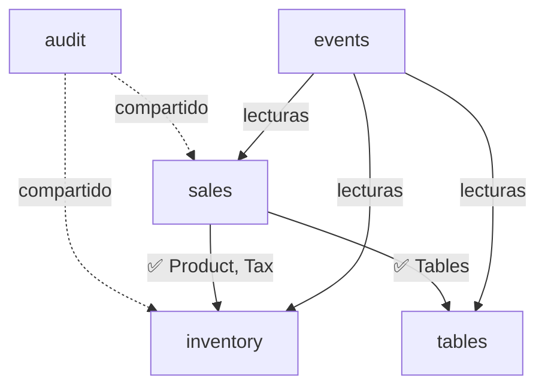

# Auditoría de Deuda Técnica - Blackshot POS

Revisión profunda de las dependencias cruzadas, responsabilidades mal ubicadas y otros problemas técnicos que se han acumulado.

## Resumen Ejecutivo

Tu arquitectura modular es sólida. El problema no es la estructura, sino que al ir creciendo rápido, algunas **responsabilidades quedaron en el módulo equivocado** y algunas **dependencias se hicieron en la dirección incorrecta**. Este plan arregla eso sin reescribir todo.

---

## Hallazgo 1: Ensalada de Responsabilidades en `sales`

> [!CAUTION]
> El módulo de **Ventas (`sales`)** está actuando como un "monolito interno". Contiene lógica que no le pertenece, lo que genera una maraña de dependencias.

### Propuesta de Reestructuración

#### 1.1 Crear Módulo de Auditoría (`pos_core/audit/`)
**Responsabilidad:** Registro histórico inmutable de acciones en todo el sistema.
- **Mover:** `AuditLog`, `AuditCategory` y `audit_service.py` desde `sales`.
- **Beneficio:** Inventario ya no dependerá de Ventas para registrar movimientos.

#### 1.2 Crear Módulo de Contabilidad / Turnos (`pos_core/accounting/`)
**Responsabilidad:** Control de flujo de efectivo, apertura/cierre de caja y arqueos.
- **Mover:** `Shift`, `ShiftStatus`, `shifts_service.py` y `shifts_router.py` desde `sales`.
- **Beneficio:** Separa la operación física (vender) de la gestión financiera (dinero en caja).

#### 1.3 Crear Módulo de Analíticas (`pos_core/analytics/`)
**Responsabilidad:** Consumo y agregación de datos para reportes y dashboards.
- **Mover:** `analytics_service.py` y `analytics_router.py` desde `sales`.
- **Beneficio:** Los reportes pesados no ensucian el código de la operación diaria.

---

## Hallazgo 2: Referencia a `is_paid` obsoleta

> [!WARNING]
> Eliminamos `is_paid` del modelo `Order`, pero quedan **dos referencias rotas** que causarán errores en producción.

#### [MODIFY] [pos_core/sales/analytics_router.py](file:///home/kaber420/Documentos/proyectos/blackshot-refactor/pos_core/sales/analytics_router.py)
- **Línea 26**: `Order.is_paid == True` → Cambiar a `Order.status == OrderStatus.PAID`.

#### [MODIFY] [pos_core/sales/shifts_service.py](file:///home/kaber420/Documentos/proyectos/blackshot-refactor/pos_core/sales/shifts_service.py)
- **Línea 156**: `"is_paid": o.is_paid` → Cambiar a `"is_paid": o.status == OrderStatus.PAID` (o mejor aún, reemplazar por `"balance_due"` y `"total_amount"`).

---

## Hallazgo 3: Shifts Service no considera propinas

> [!IMPORTANT]
> El reporte de cierre de caja (`shifts_service.py`) suma `payment.amount` para calcular los totales, pero **no separa propinas**. Después de nuestro cambio, las propinas se registran en `payment.tip_amount`, pero el Corte Z las mezcla con las ventas.

#### [MODIFY] [pos_core/sales/shifts_service.py](file:///home/kaber420/Documentos/proyectos/blackshot-refactor/pos_core/sales/shifts_service.py)
- En `close_shift()`, `list_shifts()` y `get_shift_report()`: Añadir cálculo de `total_tips = sum(p.tip_amount for p in payments)` y separarlo del ingreso neto.
- En `close_shift()`: Excluir propinas del cálculo de `expected_cash` (las propinas pueden haber sido en tarjeta).

---

## Hallazgo 4: Payment Router no pasa `tip_amount`

> [!WARNING]
> El endpoint `POST /orders/{id}/payments` en el router de ventas no acepta ni reenvía los campos `tip_amount` ni `received_amount` al servicio de pagos.

#### [MODIFY] [pos_core/sales/router.py](file:///home/kaber420/Documentos/proyectos/blackshot-refactor/pos_core/sales/router.py)
- Actualizar schema `PaymentCreate` para incluir `tip_amount: float = 0.0` y `received_amount: Optional[float] = None`.
- Pasar esos campos a `payment_service.add_payment()` en la línea 275.

---

## Hallazgo 5: Broadcast repetitivo (Code Smell)

> [!NOTE]
> En `sales/router.py`, **cada endpoint** repite las mismas 4 líneas de broadcast. Esto es un "code smell" que dificulta mantener la consistencia (si agregas un nuevo tópico, debes actualizar 10+ endpoints).

#### Propuesta (Mejora, no urgente)
Crear un helper `trigger_standard_broadcasts()` en `events/service.py`:
```python
async def trigger_standard_broadcasts():
    for topic in ["kitchen_orders", "recent_orders", "dashboard_stats", "tables"]:
        await trigger_broadcast(topic)
```
Y reemplazar las 4 llamadas repetidas en cada endpoint del router.

---

## Hallazgo 6: `stock_service.py` usa `Optional` sin importar

> [!NOTE]
> En [stock_service.py](file:///home/kaber420/Documentos/proyectos/blackshot-refactor/pos_core/inventory/services/stock_service.py) línea 28, se usa `Optional[int]` sin importar `Optional` de `typing`. Esto funciona en Python 3.10+ pero romperá en versiones anteriores. Para mayor seguridad, la importación debería estar.

#### [MODIFY] [pos_core/inventory/services/stock_service.py](file:///home/kaber420/Documentos/proyectos/blackshot-refactor/pos_core/inventory/services/stock_service.py)
- Añadir `from typing import Optional, List` al inicio.

---

## Hallazgo 7: `payment_service.py` tiene import no usado

> [!NOTE]
> `payment_service.py` importa `List` de `typing` y `Optional` no está importado aunque se usa en la firma de `received_amount`.

#### [MODIFY] [pos_core/sales/payment_service.py](file:///home/kaber420/Documentos/proyectos/blackshot-refactor/pos_core/sales/payment_service.py)
- Cambiar `from typing import List` → `from typing import List, Optional`.

---

## Mapa de Dependencias (Actual vs Deseado)

### Actual (Problemas marcados con ❌)


### Deseado (Post-Refactor)


---

## Prioridad de Ejecución

| # | Hallazgo | Severidad | Esfuerzo |
|---|----------|-----------|----------|
| 1 | `is_paid` obsoleto (Hallazgo 2) | ✅ Completado | 5 min |
| 2 | Payment Router no pasa tip (Hallazgo 4) | ✅ Completado | 5 min |
| 3 | Import de `Optional` faltante (Hallazgo 6, 7) | ✅ Completado | 2 min |
| 4 | Shifts no separa propinas (Hallazgo 3) | ✅ Completado | 15 min |
| 5 | Mover AuditLog (Hallazgo 1) | ✅ Completado | 20 min |
| 6 | Broadcast helper (Hallazgo 5) | 🟢 Mejora de mantenibilidad | 10 min |

## Verificación

### Validación Automatizada
1. Ejecutar `python3 scripts/seed_data.py` (esquema OK).
2. Iniciar el servidor con `.venv/bin/blackshot` y verificar que **no haya errores** en los logs.
3. Probar los endpoints de productos, categorías y pagos desde el frontend.

### Validación Manual
- Verificar que el endpoint de dashboard (`/analytics/dashboard`) no falle por la referencia a `is_paid`.
- Verificar que un pago con propina se registre correctamente desde el frontend.
