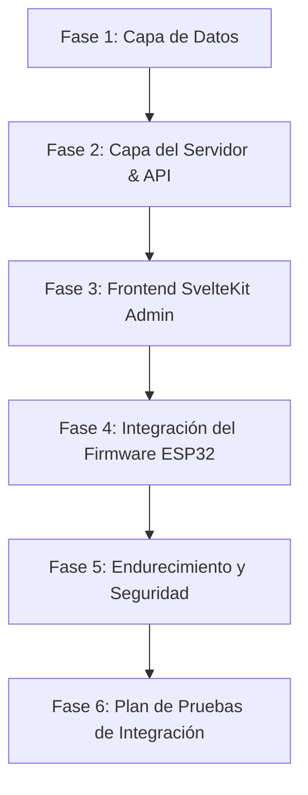

# Plan de Implementación: Portal de Configuración y Setup Wizard Premium para ESP32 (TablePads)

Este documento describe el plan detallado, estructurado en fases y pasos de desarrollo, para implementar un portal de aprovisionamiento premium, autodescubrimiento y emparejamiento seguro mediante código QR para dispositivos físicos **ESP32 (TablePads)** en el ecosistema **BlackShot POS**.

---

## 📋 Resumen del Enfoque Fásico

Para minimizar riesgos, garantizar la seguridad criptográfica y lograr una experiencia de usuario (UX) premium sin fricciones, dividiremos la implementación en **6 Fases Incrementales**:



---

## 🛠️ Fase 1: Capa de Datos (Modelos, Relaciones y Migraciones)
**Objetivo:** Extender la estructura de persistencia local para soportar metadatos avanzados de red y la sesión de emparejamiento efímera.

### 📝 Pasos de Implementación
- [ ] **Paso 1.1:** Modificar el modelo `IoTDevice` en [models.py](file:///home/kaberromero/Documentos/proyectos/BlackShotPOS/pos_core/iot/models.py) para incluir metadatos de red (IP física, SSID, señal RSSI, versión de firmware).
- [ ] **Paso 1.2:** Crear el modelo `IoTPairingSession` en [models.py](file:///home/kaberromero/Documentos/proyectos/BlackShotPOS/pos_core/iot/models.py) para almacenar tokens temporales (UUIDv4) con estado de vinculación (`pending`, `completed`, `expired`).
- [ ] **Paso 1.3:** Crear y aplicar el script de migración SQL o regeneración automática en la base de datos PostgreSQL local para reflejar las nuevas columnas y tablas.

### 💻 Blueprint de Código: `pos_core/iot/models.py`
```python
from typing import Optional
from sqlmodel import SQLModel, Field
from datetime import datetime, timezone
import uuid

class IoTDevice(SQLModel, table=True):
    id: Optional[int] = Field(default=None, primary_key=True)
    device_id: str = Field(unique=True, index=True)      # Dirección MAC física del ESP32 (Ej: "AA:BB:CC:11:22:33")
    token: str = Field(unique=True, index=True)         # Token WebSocket de larga duración
    name: Optional[str] = Field(default=None)            # E.g. "TablePad Mesa 4"
    type: str = Field(default="esp32")                   # "esp32", "sensor", etc.
    table_id: Optional[int] = Field(default=None, foreign_key="table.id")
    is_active: bool = Field(default=True)
    
    # Nuevos Metadatos de Red Física y Diagnóstico
    ip_address: Optional[str] = Field(default=None)      # IP asignada por DHCP local
    wifi_ssid: Optional[str] = Field(default=None)       # SSID al que está conectado
    rssi: Optional[int] = Field(default=None)            # Intensidad de señal Wi-Fi (dBm)
    battery_level: Optional[int] = Field(default=None)   # Batería (0-100%)
    firmware_version: Optional[str] = Field(default=None)
    
    last_seen: Optional[datetime] = Field(default=None)
    created_at: datetime = Field(default_factory=datetime.utcnow)

class IoTPairingSession(SQLModel, table=True):
    id: Optional[int] = Field(default=None, primary_key=True)
    device_id: str = Field(unique=True, index=True)      # MAC del ESP32
    pairing_token: str = Field(
        default_factory=lambda: str(uuid.uuid4()), 
        unique=True, 
        index=True
    )                                                    # UUIDv4 del QR Code
    status: str = Field(default="pending")               # "pending", "completed", "expired"
    ip_address: str                                      # IP temporal del ESP32
    table_id: Optional[int] = Field(default=None)        # Asignación de mesa seleccionada
    device_token: Optional[str] = Field(default=None)    # Token final de WebSocket generado
    expires_at: datetime                                 # Expiración (5-10 minutos)
    created_at: datetime = Field(default_factory=datetime.utcnow)
```

---

## ⚙️ Fase 2: Capa del Servidor (FastAPI - Servicios y Endpoints)
**Objetivo:** Desarrollar los controladores de backend para inicializar emparejamientos, verificar estatus en polling y completar la asociación.

### 📝 Pasos de Implementación
- [ ] **Paso 2.1:** Crear la lógica de negocio en `pos_core/iot/service.py` para instanciar la sesión de vinculación, autogenerar tokens definitivos cryptoseguros y limpiar registros expirados.
- [ ] **Paso 2.2:** Integrar endpoints en `pos_core/iot/admin_router.py` (o en un router específico de IoT) para consumo por parte del ESP32 (`/request-session` y `/status`).
- [ ] **Paso 2.3:** Integrar endpoints de administración (`/session/{pairing_token}` y `/complete`) protegidos con la dependencia `require_permission("can_manage_iot")`.
- [ ] **Paso 2.4:** Disparar un evento de sistema en el `Event Bus` (`pos_core/events/bus.py`) al completar el emparejamiento, informando al resto del ecosistema de la nueva mesa IoT activa.

### 💻 Blueprint de Código: `pos_core/iot/service.py` (Adiciones)
```python
import secrets
from datetime import datetime, timedelta, timezone
from sqlalchemy.ext.asyncio import AsyncSession
from sqlalchemy.future import select
from .models import IoTPairingSession, IoTDevice

async def create_pairing_session(db: AsyncSession, device_id: str, ip_address: str) -> IoTPairingSession:
    # Eliminar sesión previa activa de la misma MAC para evitar colisiones
    existing = await db.execute(select(IoTPairingSession).where(IoTPairingSession.device_id == device_id))
    for old_sess in existing.scalars().all():
        await db.delete(old_sess)
    
    expires_at = datetime.utcnow() + timedelta(minutes=5)
    session = IoTPairingSession(
        device_id=device_id,
        ip_address=ip_address,
        expires_at=expires_at
    )
    db.add(session)
    await db.commit()
    await db.refresh(session)
    return session

async def complete_pairing(db: AsyncSession, pairing_token: str, table_id: int) -> Optional[IoTDevice]:
    stmt = select(IoTPairingSession).where(IoTPairingSession.pairing_token == pairing_token)
    result = await db.execute(stmt)
    session = result.scalar_one_or_none()
    
    if not session or session.status != "pending" or session.expires_at < datetime.utcnow():
        return None
    
    # Generar token definitivo altamente seguro
    device_token = secrets.token_urlsafe(32)
    
    # Verificar si el dispositivo ya existe o crear uno nuevo
    dev_stmt = select(IoTDevice).where(IoTDevice.device_id == session.device_id)
    dev_result = await db.execute(dev_stmt)
    device = dev_result.scalar_one_or_none()
    
    if not device:
        device = IoTDevice(
            device_id=session.device_id,
            token=device_token,
            name=f"TablePad Mesa {table_id}",
            table_id=table_id,
            ip_address=session.ip_address,
            is_active=True
        )
        db.add(device)
    else:
        device.token = device_token
        device.table_id = table_id
        device.ip_address = session.ip_address
        device.is_active = True
        db.add(device)
        
    session.status = "completed"
    session.device_token = device_token
    session.table_id = table_id
    db.add(session)
    
    await db.commit()
    await db.refresh(device)
    return device
```

---

## 🎨 Fase 3: Portal de Setup y UX en Frontend (SvelteKit)
**Objetivo:** Desarrollar una interfaz premium de asistente ("Wizard") para el administrador en el frontend móvil de BlackShot, aprovechando la sesión ya autenticada.

```
Escaneo QR ──> Validación del Token ──> Asignación de Mesa ──> Éxito / Feedback Dinámico
```

### 📝 Pasos de Implementación
- [ ] **Paso 3.1:** Crear la ruta de emparejamiento `src/routes/admin/iot/pair/[token]/+page.svelte` en el frontend del POS (`bs_frontend`).
- [ ] **Paso 3.2:** Implementar el controlador del servidor `+page.server.ts` para capturar el token de la URL, validar su vigencia en el backend de FastAPI y cargar la lista de mesas del restaurante.
- [ ] **Paso 3.3:** Diseñar una UI moderna y responsiva optimizada para teléfonos móviles (Glassmorphism, transiciones fluidas de Svelte, feedback háptico simulado por microanimaciones).
- [ ] **Paso 3.4:** Crear un paso interactivo en la pantalla para que el administrador seleccione visualmente la mesa (con un plano o grilla de mesas) y confirme la asignación.
- [ ] **Paso 3.5:** Mostrar una pantalla animada de éxito: *"¡Dispositivo Vinculado con Éxito a la Mesa X!"* con efectos de confetti o una transición sutil en verde esmeralda.

### 🎨 Elemento de Diseño: Componente Svelte (Outline)
```html
<script lang="ts">
  import { fade, fly } from 'svelte/transition';
  
  export let data; // Trae { pairingSession, tables } desde +page.server.ts
  let selectedTableId: number | null = null;
  let loading = false;
  let success = false;
  
  async function handleConfirm() {
    if (!selectedTableId) return;
    loading = true;
    
    const res = await fetch('/api/v1/pos/iot/wizard/complete', {
      method: 'POST',
      headers: { 'Content-Type': 'application/json' },
      body: JSON.stringify({
        pairing_token: data.pairingSession.pairing_token,
        table_id: selectedTableId
      })
    });
    
    if (res.ok) {
      success = true;
    } else {
      alert("Error al vincular el dispositivo. El token puede haber expirado.");
    }
    loading = false;
  }
</script>

<div class="wizard-container" in:fade>
  {#if !success}
    <div class="card glass" in:fly={{ y: 20 }}>
      <h2>Aprovisionar TablePad</h2>
      <p class="subtitle">Dispositivo detectado: <span class="badge">{data.pairingSession.device_id}</span></p>
      
      <div class="table-selector">
        <label for="table-select">Selecciona la Mesa Física:</label>
        <div class="grid">
          {#each data.tables as table}
            <button 
              class="table-btn" 
              class:selected={selectedTableId === table.id}
              on:click={() => selectedTableId = table.id}
            >
              {table.number}
            </button>
          {/each}
        </div>
      </div>
      
      <button class="btn-confirm" disabled={!selectedTableId || loading} on:click={handleConfirm}>
        {loading ? 'Vinculando...' : 'Confirmar Asignación'}
      </button>
    </div>
  {:else}
    <div class="success-screen" in:fly={{ y: 30 }}>
      <div class="icon-success">✓</div>
      <h3>¡Vinculación Exitosa!</h3>
      <p>El TablePad ya está en línea y configurado para la mesa.</p>
    </div>
  {/if}
</div>

<style>
  .wizard-container {
    max-width: 480px;
    margin: 2rem auto;
    padding: 1rem;
  }
  .glass {
    background: rgba(255, 255, 255, 0.08);
    backdrop-filter: blur(12px);
    border: 1px solid rgba(255, 255, 255, 0.15);
    border-radius: 16px;
    padding: 2rem;
  }
  .grid {
    display: grid;
    grid-template-columns: repeat(3, 1fr);
    gap: 10px;
    margin: 1.5rem 0;
  }
  .table-btn {
    padding: 1rem;
    border-radius: 12px;
    border: 1px solid rgba(255, 255, 255, 0.1);
    background: rgba(0,0,0,0.2);
    color: white;
    cursor: pointer;
    transition: all 0.2s ease;
  }
  .table-btn.selected {
    background: var(--primary-color, #10b981);
    border-color: #10b981;
    transform: scale(1.05);
  }
  .success-screen {
    text-align: center;
    padding: 3rem;
  }
  .icon-success {
    font-size: 3rem;
    color: #10b981;
  }
</style>
```

---

## 📟 Fase 4: Firmware y SDK de Simulación (ESP32 - TablePad)
**Objetivo:** Desarrollar la lógica en el microcontrolador físico o su SDK simulado (`BlackshotUISDK`) para consultar de forma autónoma el backend, procesar la red mDNS y renderizar el QR.

### 📝 Pasos de Implementación
- [ ] **Paso 4.1:** Implementar resolución mDNS para buscar `blackshot-pos.local` en la Wi-Fi. (Si falla, habilitar el portal cautivo temporal).
- [ ] **Paso 4.2:** Desarrollar la petición HTTP POST a `/api/v1/pos/iot/wizard/request-session` enviando la dirección MAC física como identificador único.
- [ ] **Paso 4.3:** Al recibir el token de emparejamiento, formatear la URL de vinculación y renderizar el código QR en la pantalla del dispositivo.
- [ ] **Paso 4.4:** Iniciar un temporizador o bucle de consulta (Long-Polling) cada 3 segundos a `/api/v1/pos/iot/wizard/status/{device_id}`.
- [ ] **Paso 4.5:** Al recibir el token de WebSocket definitivo del backend, persistirlo en la memoria no volátil del dispositivo (NVS del ESP32 vía `Preferences.h`).
- [ ] **Paso 4.6:** Reiniciar el TablePad en modo operacional e iniciar el cliente WebSocket para comandar ventas y actualizar en tiempo real.

### 💻 Pseudocódigo del Firmware ESP32 (Arduino C++)
```cpp
#include <WiFi.h>
#include <HTTPClient.h>
#include <ESPmDNS.h>
#include <Preferences.h>
#include "qrcode.h" // Librería de render de QR

Preferences preferences;
String device_id = "";
String server_ip = "";
int server_port = 8400;

void setup() {
    Serial.begin(115200);
    device_id = WiFi.macAddress();
    
    // Conectar a la Wi-Fi registrada
    connectToSavedWiFi();
    
    preferences.begin("iot-config", false);
    String saved_token = preferences.getString("token", "");
    
    if (saved_token == "") {
        // No hay token guardado, iniciar flujo de emparejamiento
        runPairingWizard();
    } else {
        // Conectar al WebSocket directo
        connectWebSocket(saved_token);
    }
}

void runPairingWizard() {
    // 1. Resolver mDNS para encontrar el POS
    if (!MDNS.begin("esp32-tablepad")) {
        Serial.println("Error configurando mDNS");
    }
    
    Serial.println("Buscando BlackShot POS...");
    int n = MDNS.queryService("http", "tcp");
    if (n > 0) {
        server_ip = MDNS.IP(0).toString();
        server_port = MDNS.port(0);
    } else {
        server_ip = "192.168.1.100"; // Fallback estático de configuración
    }
    
    // 2. Solicitar sesión al Backend
    HTTPClient http;
    String url = "http://" + server_ip + ":" + String(server_port) + "/api/v1/pos/iot/wizard/request-session";
    http.begin(url);
    http.addHeader("Content-Type", "application/json");
    
    String jsonPayload = "{\"device_id\":\"" + device_id + "\", \"ip_address\":\"" + WiFi.localIP().toString() + "\"}";
    int httpResponseCode = http.POST(jsonPayload);
    
    if (httpResponseCode == 200) {
        String response = http.getString();
        // Parsear pairing_token del JSON...
        String pairing_token = parseJsonValue(response, "pairing_token");
        
        // 3. Pintar QR en Pantalla
        String qr_url = "http://" + server_ip + ":" + String(server_port) + "/admin/iot/pair/" + pairing_token;
        renderQRInTFT(qr_url);
        
        // 4. Polling hasta completar la vinculación
        while (true) {
            delay(3000);
            String status_url = "http://" + server_ip + ":" + String(server_port) + "/api/v1/pos/iot/wizard/status/" + device_id;
            http.begin(status_url);
            int code = http.GET();
            if (code == 200) {
                String status_res = http.getString();
                String status = parseJsonValue(status_res, "status");
                if (status == "completed") {
                    String final_token = parseJsonValue(status_res, "device_token");
                    
                    // Guardar token en NVS para futuros arranques
                    preferences.putString("token", final_token);
                    preferences.end();
                    
                    Serial.println("¡Vinculado Correctamente!");
                    ESP.restart(); // Reiniciar en modo operacional
                }
            }
        }
    }
}
```

---

## 🔒 Fase 5: Endurecimiento de Seguridad y Rate-Limiting
**Objetivo:** Proteger el backend y el portal de emparejamiento de uso indebido, ataques DoS y accesos ilegítimos.

### 📝 Pasos de Implementación
- [ ] **Paso 5.1:** Implementar **Firma de Tokens Efímeros (JWT)** en lugar de UUIDs guardados. De este modo, el código QR contiene un JWT corto firmado con la clave privada del POS que encapsula `{"mac": "...", "exp": 300}`. El servidor valida la firma directamente al escanear, evitando consultas iniciales innecesarias a la BD.
- [ ] **Paso 5.2:** Añadir políticas de **Rate Limiting** mediante middleware en el endpoint `/request-session` para evitar que un dispositivo malicioso intente iniciar miles de sesiones de emparejamiento concurrentes.
- [ ] **Paso 5.3:** Forzar expiración absoluta de las sesiones de vinculación a los **5 minutos**, asegurando que los códigos QR mostrados en mesas vacías expiren rápidamente para evitar tomas hostiles de mesas de clientes.

---

## 🧪 Fase 6: Plan de Pruebas de Integración y Validación
**Objetivo:** Ejecutar simulaciones y pruebas para verificar la resiliencia del emparejamiento bajo múltiples condiciones de falla de red.

### 📝 Pasos de Implementación
- [ ] **Paso 6.1:** Crear script de emulación con `curl` o Python para simular un ESP32 iniciando sesión de emparejamiento y comprobando estado.
- [ ] **Paso 6.2:** Probar la expiración forzada: Solicitar una sesión de QR, esperar 6 minutos, e intentar vincular desde el panel de SvelteKit. Debe retornar un error `400 Bad Request` o `410 Gone`.
- [ ] **Paso 6.3:** Realizar pruebas de desconexión: Cortar la conexión del simulador en medio del bucle de polling para validar que la base de datos libere los recursos correctamente y el cliente reintente de forma segura sin desbordamientos de memoria.
- [ ] **Paso 6.4:** Ejecutar la vinculación completa usando el simulador gráfico de terminal `BlackshotUISDK` en ejecución.

---

## 📅 Cronograma Propuesto de Entregables

| Fase | Título | Estimación (Esfuerzo) | Entregable Principal |
|:---:|:---|:---:|:---|
| **1** | Capa de Datos | 1 Día | Nuevos campos en `IoTDevice` e `IoTPairingSession` creados con migraciones operando. |
| **2** | API del Servidor | 2 Días | Endpoints `/request-session`, `/status`, `/complete` funcionando con control de permisos en FastAPI. |
| **3** | Panel Admin Svelte | 2 Días | Interfaz móvil en SvelteKit con selector de mesa, transiciones premium y pantalla de éxito. |
| **4** | Firmware / SDK | 2 Días | Bucle de autodescubrimiento mDNS, polling del simulador y guardado en memoria persistente. |
| **5** | Seguridad y Cierre | 1 Día | Rate limiting y tokens cifrados operacionales. Pruebas unitarias de flujo completo exitosas. |
