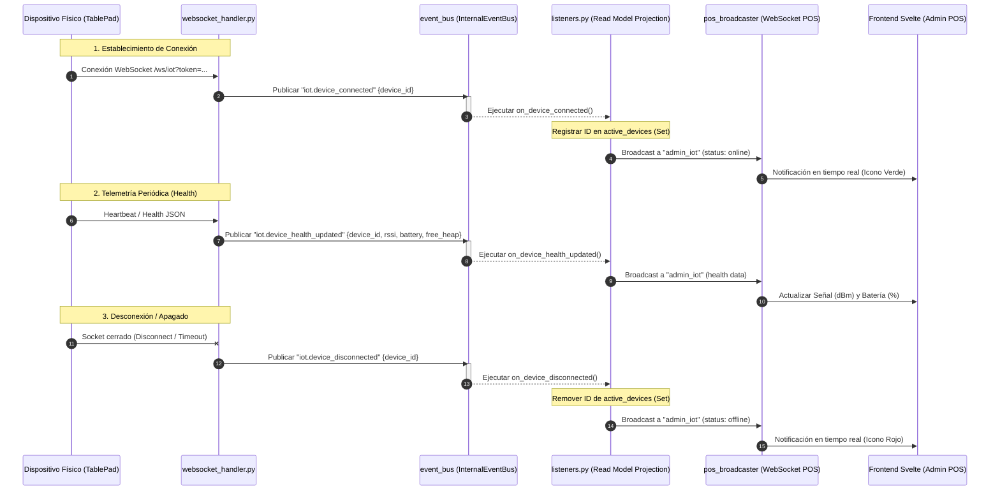

# Plan de Diseño: Reactividad y Estado de Dispositivos IoT Basado en EDA (Event-Driven Architecture)

Este documento detalla el plan de diseño y arquitectura de software para corregir la reactividad y visualización del estado de conexión (**En Línea / Desconectado**) de los dispositivos IoT (ESP32 / TablePads) en la sección de administración del POS.

El enfoque adoptado se alinea estrictamente con la **Arquitectura Orientada a Eventos (EDA)** y el principio de desacoplamiento de componentes definidos en el ecosistema **Blackshot**.

---

## 1. Diagnóstico del Problema Actual

Al analizar el código actual, se identificaron dos fallas principales que rompen la reactividad y causan que los dispositivos conectados se muestren persistentemente como `DESCONECTADO`:

1. **Ausencia de Proyección de Estado (Read Model):**
   * El estado de conexión "En línea" es una propiedad efímera y dinámica (en memoria). El modelo de datos de la base de datos `IoTDevice` no almacena este estado de forma persistente (lo cual es una buena práctica de diseño).
   * Sin embargo, al cargar el listado inicial mediante HTTP (`GET /devices`) o al suscribirse inicialmente al canal de WebSocket (`admin_iot`), el backend retorna los registros directamente de la base de datos sin inyectar dinámicamente si el dispositivo tiene un socket activo. Por lo tanto, `is_online` siempre es `undefined` o `false` al cargar la pantalla.

2. **Acoplamiento Directo vs. Flujo EDA:**
   * El archivo `websocket_handler.py` interactúa directamente con el objeto global `pos_broadcaster` para enviar notificaciones web en tiempo real:
     ```python
     await pos_broadcaster.broadcast("admin_iot", {"type": "status", "device_id": device_id, "status": "online"})
     ```
   * Esto rompe el patrón de **Arquitectura Orientada a Eventos (EDA)** del POS. El manejador de sockets del hardware no debería conocer la existencia de una interfaz de administración web ni cómo estructurar sus payloads específicos. En su lugar, debería simplemente emitir eventos crudos de dominio al bus de eventos (`event_bus`) y dejar que un componente especializado (el Listener/Proyección) procese y retransmita la información.

3. **Condición de Carrera en el Frontend (Mount Race Condition):**
   * En `+page.svelte` de la administración de dispositivos, se realiza una suscripción al WebSocket y, en paralelo, una llamada asíncrona HTTP `listDevices()`. Al completarse la petición REST, se sobreescribe el estado completo del array `posSocket.iotDevices` con los datos estáticos de la BD, descartando cualquier actualización rápida de telemetría o estado de conexión que el WebSocket ya hubiese procesado.

---

## 2. Propuesta de Arquitectura (EDA Puro)

Proponemos implementar una **proyección en memoria / modelo de lectura** desacoplado mediante el `event_bus` central del POS.

### Diagrama de Secuencia y Flujo de Eventos (Mermaid)



---

## 3. Especificación Técnica de Cambios

A continuación se detallan los blueprints de código y los cambios sugeridos para cada uno de los archivos involucrados en el POS local.

### 3.1. Registro Efímero de Conexiones
Para evitar dependencias circulares y mantener el sistema sumamente ligero, se mantendrá un conjunto de IDs de tipo `set` en memoria dentro de `pos_core/iot/websocket_handler.py` (o en un módulo dedicado de conexiones):

```python
# pos_core/iot/websocket_handler.py

# Registro en memoria de IDs de dispositivos IoT activos (conectados vía WebSocket)
active_devices = set()
```

---

### 3.2. Ciclo de Vida en `websocket_handler.py`
Modificar `handle_iot_session` para delegar por completo las notificaciones al bus de eventos y asegurar que la limpieza se realice de manera robusta en el bloque `finally`:

```python
# pos_core/iot/websocket_handler.py (Modificaciones sugeridas)

from pos_core.events.bus import event_bus

async def handle_iot_session(websocket: WebSocket, db: AsyncSession, device: any):
    table_id = device.table_id
    device_id = device.id
    topic = f"iot_table_{table_id}"
    
    # 1. Registro e Inicialización EDA
    iot_broadcaster.connect(websocket, topic)
    
    # Emitir evento de conexión al Bus de Eventos Central
    await event_bus.publish("iot.device_connected", {
        "device_id": device_id,
        "table_id": table_id
    })

    # 2. Configuración Inicial (Zero-Config)
    try:
        settings = await get_settings(db)
        await websocket.send_json({
            "event": "config",
            "data": {
                "business_name": settings.name,
                "device_name": device.name or f"Mesa {table_id}",
                "table_id": int(table_id) if table_id else 0
            }
        })
    except Exception as e:
        logger.error(f"⚠️ Error al enviar config inicial a IoT {device_id}: {e}")

    # 3. Bucle de Comunicación Principal
    try:
        await update_device_last_seen(db, device_id)
        
        while True:
            data = await websocket.receive_json()
            action = data.get("action")
            payload = data.get("data") or data.get("payload") or {}
            
            if action == "ping":
                await websocket.send_json({"event": "pong"})
                await update_device_last_seen(db, device_id)
            
            elif action in ["health", "heartbeat"]:
                # Extraer métricas de telemetría de forma segura
                rssi = payload.get("rssi") if isinstance(payload, dict) else data.get("rssi")
                battery = payload.get("battery") if isinstance(payload, dict) else data.get("battery")
                free_heap = payload.get("free_heap") if isinstance(payload, dict) else data.get("free_heap")
                
                # Actualizar base de datos
                await update_device_health(db, device_id, rssi=rssi, battery=battery)
                
                # Emitir telemetría al Bus de Eventos Central
                await event_bus.publish("iot.device_health_updated", {
                    "device_id": device_id,
                    "rssi": rssi,
                    "battery": battery,
                    "free_heap": free_heap
                })
            
            elif action == "sync_orders":
                await _handle_sync_orders(websocket, db, table_id)

            elif action == "call_waiter":
                await event_bus.publish("iot.waiter_requested", {"table_id": table_id, "device_id": device_id})
                await websocket.send_json({"event": "msg", "data": {"message": "Mesero en camino"}})

            elif action == "request_bill":
                await event_bus.publish("iot.bill_requested", {"table_id": table_id, "device_id": device_id})
                await websocket.send_json({"event": "msg", "data": {"message": "Solicitando cuenta..."}})

            elif action == "clear_table":
                await event_bus.publish("iot.clear_table_requested", {
                    "table_id": table_id,
                    "device_id": device_id
                })

    except WebSocketDisconnect:
        logger.info(f"🔌 Dispositivo IoT físicamente desconectado: {device.device_id}")
    except Exception as e:
        logger.error(f"❌ Error crítico en sesión IoT {device_id}: {e}")
    finally:
        # Limpieza absoluta de recursos
        iot_broadcaster.disconnect(websocket, topic)
        
        # Publicar desconexión en el Bus de Eventos Central
        await event_bus.publish("iot.device_disconnected", {
            "device_id": device_id,
            "table_id": table_id
        })
```

---

### 3.3. Proyección de Estado en `listeners.py`
En `pos_core/iot/listeners.py`, centralizaremos la captura de estos eventos y la comunicación hacia el canal WebSocket de la interfaz Web (`admin_iot`), manteniendo sincronizado el conjunto en memoria:

```python
# pos_core/iot/listeners.py (Adiciones de listeners sugeridas)

from pos_core.iot.websocket_handler import active_devices
from pos_core.events.manager import pos_broadcaster

@on_event("iot.device_connected")
async def on_device_connected(payload: dict, metadata: dict):
    """Proyección EDA: Registra la conexión y notifica en tiempo real a la Web Admin."""
    device_id = payload.get("device_id")
    if device_id:
        active_devices.add(device_id)
        await pos_broadcaster.broadcast("admin_iot", {
            "type": "status",
            "device_id": device_id,
            "status": "online"
        })
        logger.info(f"📡 [IoT EDA] Dispositivo #{device_id} marcado EN LÍNEA y propagado a UI Admin.")

@on_event("iot.device_disconnected")
async def on_device_disconnected(payload: dict, metadata: dict):
    """Proyección EDA: Remueve la conexión y notifica en tiempo real a la Web Admin."""
    device_id = payload.get("device_id")
    if device_id:
        active_devices.discard(device_id)
        await pos_broadcaster.broadcast("admin_iot", {
            "type": "status",
            "device_id": device_id,
            "status": "offline"
        })
        logger.info(f"📡 [IoT EDA] Dispositivo #{device_id} marcado DESCONECTADO y propagado a UI Admin.")

@on_event("iot.device_health_updated")
async def on_device_health_updated(payload: dict, metadata: dict):
    """Proyección EDA: Propaga las estadísticas físicas en tiempo real al panel Web Admin."""
    device_id = payload.get("device_id")
    rssi = payload.get("rssi")
    battery = payload.get("battery")
    free_heap = payload.get("free_heap")
    
    if device_id:
        await pos_broadcaster.broadcast("admin_iot", {
            "type": "health",
            "device_id": device_id,
            "rssi": rssi,
            "battery": battery,
            "free_heap": free_heap
        })
```

---

### 3.4. Consistencia en los Endpoints de Consulta

Para que la página sea consistente desde el primer milisegundo de su carga (evitando tener que esperar al siguiente latido/evento del socket), debemos inyectar la propiedad `is_online` evaluando nuestro Read Model efímero en las APIs REST y en el snapshot de suscripción de sockets.

#### En `admin_router.py` (Listado HTTP):
```python
# pos_core/iot/admin_router.py

from pydantic import BaseModel
from .models import IoTDevice
from .websocket_handler import active_devices

# 1. Definir el esquema extendido de respuesta
class IoTDeviceResponse(IoTDevice):
    is_online: bool = False

# 2. Actualizar el endpoint para retornar el esquema con estado evaluado
@router.get("/devices", response_model=List[IoTDeviceResponse])
async def list_devices(
    db: AsyncSession = Depends(get_session),
    user=Depends(require_permission("can_manage_iot"))
):
    """Lista todos los dispositivos IoT inyectando su estado en tiempo real."""
    devices = await service.get_all_devices(db)
    
    response_devices = []
    for d in devices:
        dumped = d.model_dump()
        # Inyectar dinámicamente evaluando contra el Read Model en memoria
        dumped["is_online"] = d.id in active_devices
        response_devices.append(dumped)
        
    return response_devices
```

#### En `providers.py` (WebSocket snapshot):
```python
# pos_core/iot/providers.py

from pos_core.iot.websocket_handler import active_devices

@topic_provider("admin_iot")
async def provide_admin_iot(db: AsyncSession):
    """Proveedor del snapshot inicial para el canal 'admin_iot'."""
    devices = await get_all_devices(db)
    
    result = []
    for d in devices:
        dumped = d.model_dump(mode="json")
        # Inyectar el estado basándonos en la proyección en memoria
        dumped["is_online"] = d.id in active_devices
        result.append(dumped)
        
    return result
```

---

### 3.5. Corrección de la Carga Inicial en el Frontend (SvelteKit)
En `bs_frontend/src/routes/(app)/admin/devices/+page.svelte`, dado que tanto el endpoint HTTP como el WebSocket ahora inyectarán correctamente el estado de `is_online` desde la inicialización, la asignación es 100% segura y libre de discrepancias.

No obstante, para garantizar una UX sumamente fluida y evitar parpadeos visuales al sobreescribir el array, la inicialización en `onMount` se reduce a:

```typescript
    onMount(async () => {
        // Suscribirse al WebSocket para actualizaciones en tiempo real y recibir snapshot inicial
        posSocket.subscribe('admin_iot');
        
        try {
            // Cargar datos iniciales por HTTP como respaldo y consistencia
            const devices = await IoTService.listDevices();
            posSocket.iotDevices = devices;
        } catch (e) {
            toast.error("Error cargando dispositivos");
        } finally {
            isLoading = false;
        }
    });
```

---

## 4. Plan de Pruebas y Validación

Una vez implementado, el flujo EDA puede ser validado con los siguientes pasos:

1. **Prueba de Carga Inicial Silenciosa:**
   * Abrir la terminal y encender el simulador: `python scripts/tools/iot_device_sim.py <TOKEN>`
   * Con el simulador conectado, abrir la página web `http://localhost:5173/admin/devices`.
   * El dispositivo debe mostrarse **CONECTADO** (verde) inmediatamente desde la carga inicial, confirmando que `list_devices` inyecta correctamente el estado desde `active_devices`.

2. **Prueba de Conexión en Caliente (Reactividad de Entrada):**
   * Apagar el simulador. En la Web Admin, el dispositivo debe cambiar instantáneamente a **DESCONECTADO** (rojo).
   * Encender de nuevo el simulador. En menos de 100ms, la tarjeta del dispositivo en la Web Admin debe transformarse, mostrando la barra de pulsos en verde, confirmando la propagación del evento `iot.device_connected`.

3. **Prueba de Telemetría (Health Report):**
   * Con el simulador encendido, presionar la tecla `B` en la consola del simulador para simular una caída de batería.
   * Confirmar que el porcentaje de batería y la barra de estado de señal (dBm) se actualizan dinámicamente en el panel del POS sin recargar el navegador, validando el evento `iot.device_health_updated`.
